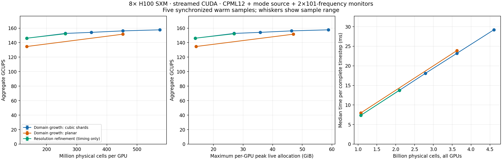

# Eight-H100 CUDA capacity and throughput study

## Results

Increasing the balanced domain from 1.074 to 4.607 billion physical cells raises
warm streamed-CUDA throughput from **146.10 to 157.66 GCUPS**: 4.29× the cells
for 7.9% more throughput. The final three successful volume increases add
33.1%, 29.8%, and 27.1% cells but only 0.96%, 1.32%, and 0.92% throughput.
This meets the study's empirical plateau criterion. Simply enlarging these
domains does not provide evidence for reaching 250 GCUPS, which would require
another 58.6% throughput improvement over the best measured rate.

| Case | Global `(z,y,x)` | Billion cells | GCUPS | Peak live GiB, max GPU | Retained-output live GiB, max GPU |
| --- | --- | ---: | ---: | ---: | ---: |
| Balanced, 80 nm | 512 × 512 × 4096 | 1.074 | 146.10 | 13.84 | 9.62 |
| Balanced, 80 nm | 640 × 640 × 5120 | 2.097 | 152.71 | 26.98 | 18.62 |
| Balanced, 80 nm | 704 × 704 × 5632 | 2.791 | 154.18 | 35.84 | 24.68 |
| Balanced, 80 nm | 768 × 768 × 6144 | 3.624 | 156.23 | 46.40 | 31.82 |
| Balanced, 80 nm | 832 × 832 × 6656 | 4.607 | **157.66** | 58.82 | 40.24 |
| Balanced, 80 nm | 896 × 896 × 7168 | 5.755 | **Setup OOM** | unavailable | unavailable |
| Planar, 80 nm | 128 × 1024 × 8192 | 1.074 | 134.66 | 14.10 | 10.13 |
| Planar, 80 nm | 192 × 1536 × 12288 | 3.624 | 151.63 | 46.99 | 32.91 |
| Refined, 64 nm | 640 × 640 × 5120 | 2.097 | 152.23† | 26.98 | 18.62 |

† The 64 nm propagated raw-field comparison failed its existing pointwise gate;
this is timing evidence, not an accepted accuracy result. Both flux spectra
passed. See numerical validation below.

The planar domain improves 12.6% for 3.375× more cells and reaches 151.63 GCUPS,
2.94% below the balanced domain at the same 3.624-billion-cell count. Shape still
matters, but its gap narrows from 7.8% at 1.074 billion cells. Only two planar
sizes were tested, so that series alone does not establish a plateau. Refining
the fixed physical domain from 80 to 64 nm gives 152.23 GCUPS, within 0.32% of
the 80 nm domain-growth case with the same number of cells.



The balanced 832 case takes **29.22 ms per complete timestep**, or 7.48 s per
256-step sample. Its physical domain is 66.56 × 66.56 × 532.48 µm at 80 nm.
Five samples have 0.089% coefficient of variation. These repeat timings of one
initialized process; they do not establish fresh-process capacity reliability.

At the next size, GPU 0 failed to allocate another 2.69 GiB in
`sharding.place_tree(program, program.coefficients)`, before compilation/timing.
Sampled GPU-0 residency reached 76.64 GiB. This brackets the observed setup
capacity boundary between the two tested sizes; it is not a binary-searched
maximum or proof that eight GPUs' stepping arrays fill all available memory.
At 832, maximum live allocation is 58.82 GiB while the allocator reserves
75.22 GiB and sampled device residency reaches 77.60 GiB. Physical memory is
79.65 GiB per GPU. The cumulative peak is dominated by preparation on GPU 0;
the retained-output snapshot is only 40.24 GiB per GPU.

The immediate capacity follow-up is to trace coefficient placement and remove
the GPU-0 allocation peak, then measure a separately labelled donating-state
path. For throughput, use a host that permits hardware counters to measure
HBM traffic, occupancy, and communication stalls before selecting another
kernel change. No hardware-bandwidth saturation claim follows from this sweep.

## Question and protocol

Does increasing cell count beyond the previous 2.097-billion-cell benchmark
improve synchronized `cuda_streamed` throughput, and where does the memory
capacity limit occur? This study uses the accepted ABI-21 native binary from
`f98fdc4`, with SHA-256
`6753641e1a682751ad00c10abda53bd4cd33fd3569ccf048baea018bb94be00d`.
Runtime kernels are unchanged. The deployment manifest identifies the local
source commit and file hashes; the remote Git commit is an archive snapshot.

All measurements use eight H100 SXM 80 GB GPUs, x-axis partitioning, FP32 CPML,
fast math disabled, 12-cell CPML on all external faces, a TE mode source, and two
101-frequency mode monitors. Each fresh process initializes on CPU, distributes
the state, compiles, warms up once, then measures five synchronized 256-step
samples. Input state is retained, matching the prior benchmark; this capacity
limit is not necessarily the limit of a donating/evolving-state application.
The geometry is a straight waveguide with extensive cladding at the larger
sizes. It exercises realistic source, boundary, and monitor operations, but is
not a benchmark of a densely populated full-chip device or arbitrary materials.

The balanced domain-growth series uses `(z,y,x)=(n,n,8n)` at 80 nm spacing.
The planar series uses `(n,8n,64n)` at 80 nm. The fixed-physical-domain series
uses `(n,n,8n)` with spacing `80*512/n` nm, retaining a physical domain of
40.96 × 40.96 × 327.68 µm. Nominal core dimensions remain 320 × 480 nm,
with each half-width rounded to whole cells, so realized interface positions
change with discretization. This is a nominal fixed geometry, not an exact
subpixel-preserving rasterization. The source envelope has fixed physical time scale.
Source/monitor apertures are fixed in physical units; their sampled size grows
with refinement. Twelve CPML cells have varying physical thickness in that
series. These timing tests do not establish spatial convergence or comparable
absorption error across resolutions.

GCUPS counts physical cells times complete Yee timesteps, including source and
monitor arithmetic, divided by median synchronized runtime. Setup, compilation,
finite-state checks, and any profiling are excluded. The source pulse and ports
can be far apart relative to these short runs; nonzero monitor weights verify
observation execution, not pulse arrival or a converged spectrum.

Memory is reported as per-device allocator live/peak allocations separately from
allocator pool size and sampled `nvidia-smi` process/device residency. The latter
is sampled every 500 ms across setup, compilation, and timing and can miss short
peaks. GPU utilization and memory utilization from `nvidia-smi` are activity
metrics, not achieved HBM bandwidth or SM occupancy. Allocator fraction is 0.95,
with preallocation disabled (previous study used 0.80).

A throughput plateau requires two successive substantial volume increases with
less than 3% improvement and sample variability below that difference. The
largest successful probe is distinguished from the largest repeatedly validated
size and any failed allocation boundary. A failed probe is retained as evidence.

## Execution

RunPod pod `d5yvneey683trr`, AP-IN-1, created 2026-09-26 17:29:52.756 UTC at
$27.92/hour. Additional spending authorization: $50. All-pair NV18 topology
verified. Deleted at 18:59:34 UTC after artifact verification; the follow-up
lookup returned 404 at 18:59:39 UTC. Conservative creation-to-verification
compute estimate is $41.77, approximately **$42 including disk**, below the
$50 additional cap. The billing snapshot is delayed (only the 17:00–18:00
bucket was available) and must not be presented as a final invoice. No volume
was created. The independent deletion guard was cancelled only after the 404.

The 640 baseline reproduces the previous accepted 151.57 GCUPS result within
0.8%; the planar baseline reproduces 135.50 GCUPS within 0.7%. The balanced
896 probe failed by allocation, not timeout. A recorded controller held the
runner while this probe completed, then ran propagated numerical checks and
selected planar-192 from remaining time using measured setup cost, not observed
throughput. More refinement points and planar-224 were not run within this
budget. Primary measurement deadline was 19:00 UTC, adaptive tail 19:05 UTC,
with an independent deletion guard at 19:09 UTC.

An interrupted original runner left the balanced-640 NVML sampler running
beyond that case. The original log is preserved. `telemetry-windows.json`
records its start and remote result-file modification time; the summarizer
clips that telemetry to the case interval. Allocator statistics and timing
samples come directly from the completed worker and are unaffected.

Nsight Compute is installed, but an isolated CUDA-kernel probe returned
`ERR_NVGPUCTRPERM`. The host restricts hardware counters and the container lacks
the required permission. Hardware bandwidth, occupancy, and stall metrics
are unavailable on this run. Sampled NVML activity must not be substituted for
those metrics. The probe ran between benchmark processes with all GPUs idle;
its log and the idle check are retained.

## Numerical validation

Every successful throughput case has finite final state and both 101-frequency
monitors have weight 256 at every frequency. Separate small propagated cases
compare eight-GPU CUDA with one-GPU JAX using the unchanged pointwise gate
`rtol=3e-5`, `atol=max(1e-12, 2e-6*max(abs(reference array)))`.

- **80 nm, 64 × 96 × 256, 2,048 steps: passes** real/imaginary DFT arrays,
  weights, and both nonzero flux spectra. Maximum DFT relative L2 error is
  6.18e-7; maximum flux relative L2 error is 3.94e-7.
- **64 nm, 80 × 120 × 320, 2,560 steps: fails** the raw DFT gate. Real and
  imaginary relative L2 errors are 5.53e-6 and 5.71e-6. Respectively 393 and
  376 of 441,168 entries exceed their pointwise tolerances, by at most 2.88×
  and 2.64×. Weights and both flux spectra pass; flux relative L2 error is
  at most 6.09e-7. Tolerances were not relaxed. The cause remains under
  investigation, and the refinement result must not be treated as validated.

A follow-up one-GPU CUDA run at 64 nm also fails the JAX raw-DFT comparison
(maximum relative L2 5.76e-6) while its flux spectra pass. One- versus eight-GPU
CUDA passes the full gate, with maximum DFT relative L2 6.43e-7. This points to
a CUDA/JAX arithmetic discrepancy shared across device counts, rather than an
eight-GPU-specific failure; it does not isolate the offending operation.

These checks exercise pulse propagation but do not establish spatial or temporal
convergence, or validate complete optical results on the billion-cell domains.
No pure-JAX capacity/throughput sweep was performed in this additional run.

The repository's Makefile lint scope passes Ruff and formatting (343 files).
Small CPU construction/monitor smoke checks at 80 and 40 nm also passed.
The broader `ruff check .` finds 132 errors and its format check finds 16 files
requiring formatting, including archived diagnostic scripts outside that lint
scope. No solver changes or new full CPU-suite run were made for this capacity
study; the draft PR retains the preceding full-suite and audit failures.

## Environment controls

The eight physical GPU UUIDs match the prior study. JAX, jaxlib, the CUDA12
plugins, NVIDIA CUDA12 libraries, and NCCL versions match. NumPy is 2.5.3
(previously 2.4.1) and SciPy is 1.18.1 (previously 1.17.0); other CPU-side
package differences are recorded in `dependency-differences.json`. Thus this is
a calibrated reproduction of the previous rates, not a byte-identical Python
environment. All points within the new sweep share the same environment.
Cold setup times should not be compared directly across the two studies.

## Evidence and reproduction

[Compact JSON, CSV, plots, validation comparisons, source snapshots, and
manifests](h100-capacity-20260926/) are committed with the benchmark scripts.
The controller source is preserved verbatim as `finish-controller.py.txt`.
The accepted native and worker hashes agree across all eight successful timing
cases. Failed allocation logs are retained; no rate is assigned to that probe.

Before deleting the pod, all **69 remote files (19,835,088 bytes)** were verified
against their remote SHA-256 manifest. Raw NPZs and telemetry remain in the
local 10,704,094-byte archive
`benchmarks/results/h100-capacity-20260926/h100-capacity-20260926.tar.gz`, SHA-256
`14d7c6dae277cd1a5bd0a10ca08f67cd7ae3c47f903299e1cd1359b1b884cecd`.
That archive is not uploaded to the PR. It also contains the locally derived
64 nm diagnostic counts, distinguished from remote evidence in `archive.json`.

Regenerate the derived tables and figure from the extracted raw evidence:

```sh
python scripts/summarize_h100_capacity.py \
  benchmarks/results/h100-capacity-20260926/raw/sweep \
  benchmarks/reports/h100-capacity-20260926
```

The figure uses sample ranges, not confidence intervals. The green curve reuses
the balanced-512 measurement as its identical 80 nm physical-domain reference.
No solver or native-kernel optimization was introduced during this sweep.
