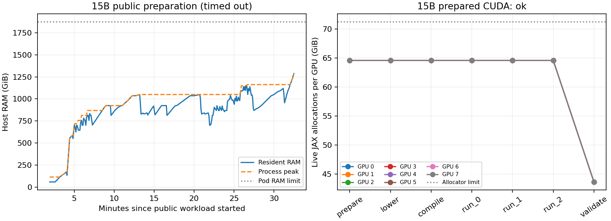

# H100 compilation-memory acceptance

2026-09-27. **Partial acceptance: prepared 15B stepping succeeds, but the full
public 15B workload remains unvalidated.** Its host preparation exceeded the
32½-minute timeout. Both rented pods were deleted; conservative compute plus
storage accounting is **under $22.97** against the $25 budget. Billing records
had not posted at teardown.

This follows PR #288 and the RTX 3090 fixes `4ce2335` / `345d68f`. The baseline
is `d6cd7f3`. No native CUDA kernels or arithmetic precision changed. The H100
harness starts at `3b561cb`; the final local-coordinate seed fix is `4267525`.

## Results and limits

| Gate | Result |
| --- | --- |
| One H100 | 14 capacity/continuation parity tests passed |
| Two H100s | 8 real x/z continuation tests passed, both backends and automatic/forced capacity policy |
| Eight H100s, propagated modes | CUDA and JAX spectra passed unchanged tolerances against one-H100 JAX |
| Eight H100s, full-state checks | All numerical checks passed with established CPML and physical-field bounds; the test's final nonreplication assertion failed on an unpartitionable logical shape, discussed below |
| Prepared CUDA 15B | Both revisions completed 96 steps at about 154 GCUPS |
| Public modal CUDA 15B | Timed out during preparation; no compilation or stepping result |
| Single-H100 modal CUDA throughput | 20.256 → 20.271 GCUPS; one process pair, five warm segments each |
| Full <5% regression acceptance | Incomplete: repeated process pairs and JAX/two-GPU performance comparisons did not fit the budget |

The single-H100 comparison uses a 256³ grid, 12-cell FP32 CPML, a mode source,
two 101-frequency mode monitors, and donating continuation. Fixed runtime is
0.07% faster; sample CVs are 0.043% and 0.031%. Compilation is 1.528 → 1.541 s.
CUDA `auto` retained the fast schedule. This is a useful initial comparison,
not a universal nonregression claim or the planned three-pair sweep.

## Prepared 15-billion-cell capacity

The `(10000,1250,1200)` z-partitioned fixture allocates six FP32 Yee fields,
three dense electric coefficient arrays and 12-cell FP32 CPML directly on the
destination GPUs. Nonzero pulses cross every partition interface. It has no
mode source or monitor and bypasses full host material construction.

Every GPU held **64.60 GiB** after preparation, with a **65.14 GiB** allocator
peak. Executable scratch was **40.16 MiB per GPU**. Host peak was **21.94 GiB**. Coefficients are released after all timed calls
before bounded validation, explaining the allocation drop at that stage.
Both versions executed three consecutive 32-step calls and validated finite,
nonzero fields, all CPML leaves, and the final step counter.

| Revision | Prepare | Compile | Warm throughput | Final step |
| --- | ---: | ---: | ---: | ---: |
| Baseline `d6cd7f3` | 14.26 s | 0.62 s | 154.09 GCUPS | 96 |
| Fixed `345d68f` solver | 14.93 s | 0.62 s | 153.95 GCUPS | 96 |

Throughput uses the median of segments two and three, excluding first-call
overhead. Runtime changed by +0.09%. Both had the same executable scratch.
The fixed scheduler selected capacity mode automatically.

**The baseline also fits this simpler fixture.** Consequently, it does not
reproduce the original modal-workload failure and does not prove that the
compiler fix resolves that failure.

## Public 15B preparation remains the bottleneck

The public case retained the original 80 nm resolution, binary straight
waveguide, 12-cell CPML, mode source and two 101-frequency mode monitors. Its
physical extent is 800 × 100 × 96 µm in `(z,y,x)` order. This is a capacity stress
case with substantial cladding, not a completed optical device simulation.

Preparation did not return within **1,950 seconds**. Termination and memory
reclamation brought worker wall time to **2,014.50 seconds**. Sampled process
high-water RSS reached **1,287.64 GiB (1.26 TiB)**. The pod had 2,013 GB host RAM;
this run demonstrates excessive preparation time/memory, **not a measured host
OOM**. No `prepare` completion snapshot, compiled executable or timed stepping
result was produced. CPU preparation stages were not individually instrumented,
so this run does not localize the dominant constructor precisely.

A read-only stack-profiler attachment was rejected by the container's ptrace
permissions. Host process telemetry and the timeout record are retained.

## Numerical validation and return-state placement

The two-H100 suite uses 17+31-step public continuations on actual x/z meshes,
random initial fields, sources, CPML and two 101-frequency mode monitors.
These are real communication tests, not forced one-rank meshes.

The eight-H100 spectrum gate runs 2,048 steps on `(128,96,256)` with z
partitioning. Both monitor spectra are nonzero. CUDA and JAX pass the unchanged
comparison (`rtol=3e-5`, array-scaled 2-ppm absolute tolerance); worst array
relative L2 errors are **6.90e-7** and **6.47e-7**, respectively. Earlier retrieved
one-H100 CUDA and two-H100 x/JAX spectra also pass on `(64,96,256)`.

The new eight-GPU random-state test initially failed a 1-ppm CPML absolute-scale
bound at a few cancellation values. The old baseline reproduced the same
values and failures. The test now uses the **existing prepared-fixture 3-ppm
CPML bound**, keeps the original bounds for other state leaves, and adds the
**stricter 2-ppm physical-field triplet check without the helper's absolute
floor**. All eight H100 cases passed those numerical checks.

They then failed a separate, overstrict placement assertion. The test geometry
`(137,41,145)` produces an Ex logical shape `(138,42,145)`: none of its axes is
divisible by eight. `crop_component()` preserves canonical public shapes and
currently falls back to replication when no axis can be evenly partitioned.
This behavior predates these changes; existing local JAX tests already condition
nonreplication checks on divisibility. The hardware assertion is now similarly
conditional. **The final assertion correction was not rerun on H100s.** The raw
failed pytest logs are retained rather than relabeled as passing runs.

The 15B target has divisible axes, so this particular return-state fallback
should not be inferred as the cause of its preparation timeout. It is still
an important capacity limitation for arbitrary public grid dimensions. The
prepared stepping benchmark retains padded distributed state and does not
exercise the public crop path.

## Harness correction and execution controls

Two initial capacity attempts failed before solver compilation: a global pulse
scatter gathered a **55.97 GiB** field even with explicit output sharding.
Local-coordinate seeding inside `shard_map` fixed this (`4267525`). Both
successful revisions used the same corrected harness. The excluded failures
remain in `raw/initial-seed-gather/` and `raw/explicit-seed-gather/`.

Eight-H100 stock was initially unavailable. The first two-H100 SXM pod cost
$6.98/hour and had NV18 connectivity. After its correctness gates, an eight-H100
SXM allocation appeared in AP-IN-1 at $27.92/hour. Both passed load checks with
no thermal/throughput outlier. Eight-GPU matmul counts ranged from 25,371 to
26,412 over 45 seconds. GPU UUIDs, topology and telemetry are retained.

Small correctness/diagnostic jobs used a 3% allocator pool while the large
workload was in CPU preparation. A controller would kill them before public
lowering/compilation if preparation completed. Their timing is not used as a
performance result. The final single-H100 throughput pair ran after termination
of the large worker, with the same 90% allocator setting for both revisions.
The attempted concurrent performance controller never launched a benchmark.

This run uses preallocated 90% pools and three 32-step capacity segments; the
original PR #288 attempt used a growing 95% pool and planned six 64-step calls.
Native layout calibration is disabled equally for both revisions here, separate
from XLA compiler autotuning. NCCL uses defaults on the new host; the earlier
attempt disabled NVLS. These differences prevent attribution of every outcome
solely to the compiler patch. A 96-step capacity run is not optical completion.

## Next acceptance work

1. Instrument public material construction, coefficient generation, initial-state
   copies and placement separately. Bound or stream those host allocations;
   GPU stepping capacity is no longer the only limiting resource.
2. Rerun the full public 15B case after reducing preparation cost, including
   compilation and repeated execution. Preserve source/monitor parity gates.
3. Complete three alternating baseline/fixed process pairs for both backends
   on one/two H100s, and fitting multi-GPU cases. Pure JAX execution workspace
   remains a separate capacity limit; no large JAX capacity result was obtained.
4. Document or improve canonical-state replication for unpartitionable shapes.
   Until then, choose dimensions with divisible logical axes for large public
   continuations.

## Evidence and cost

[h100-accept25/](h100-accept25/) contains raw records, runners, original revisions,
solver/harness hashes, native extension hash, environment and a generated
summary. Pod checkouts are Git-initialized source snapshots; their local commit
IDs differ from original revisions mapped in `manifest.json`.

All **58 final remote files** were retrieved and verified against
[`raw/SHA256SUMS`](h100-accept25/raw/SHA256SUMS) before deletion. The two-GPU pod
was confirmed absent at 09:59:52 UTC; the eight-GPU pod at 10:45:11 UTC, before
its independent 10:46 deletion deadline. Both deletion requests returned 204
and subsequent reads returned 404. Unrelated resources were untouched.

Conservative wall-time compute: **$22.9154**. Adding a $0.05 storage allowance
keeps the estimate below **$22.97**. RunPod billing queries still returned no
posted records; this is an estimate, not a claim of zero charges.

Local verification after the run: **14 tests passed**, including the rectangular
two-rank capacity fixture, memory-policy tests, and the existing local JAX
DFT/continuation contract on two, four and eight CPU devices.
