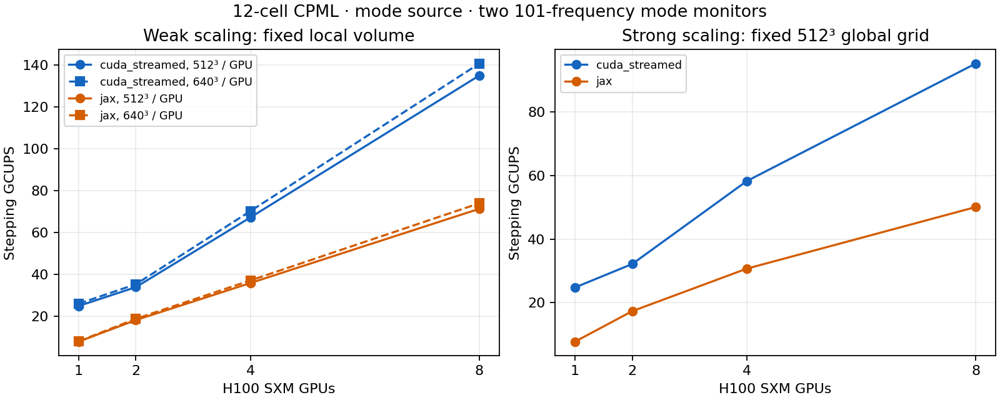

# H100 modal correctness, completion, and scaling

This follow-up measures a finite-pulse S-bend to completion separately from warm
stepping throughput on a size sweep. The acceptance targets remain 150 GCUPS for
`cuda_streamed` and 75 GCUPS for pure JAX on eight H100 SXMs. A short stepping
benchmark does not establish time to a converged optical spectrum.

Final accepted CUDA commit `f98fdc4` reaches **151.57 GCUPS** on eight GPUs
at 640×640×5120 cells, versus **73.92 GCUPS** for pure JAX. The CUDA target is
met for that warm capacity case; JAX remains 1.08 GCUPS short. The thinner
128×1024×8192 case reaches **135.50 / 66.76 GCUPS** (CUDA / JAX), so the targets
are not met for every shape. The accepted completion comparisons pass the original
numerical gate. The owned pod is deleted and all raw evidence is verified locally.

## Correctness changes

The original 4,096-step, 128×512×1024 modal comparison exposed two independent
floating-point effects. XLA reassociated the DFT angular-frequency/time product;
rounding barriers on both products restore the native FP32 operation order.
Bounded CUDA graphs also restarted their floating-point observation clock at
each graph chunk. They now retain one invocation origin and an integer elapsed
step count. Continuation still respects the incoming state's time.

The CUDA interface is ABI 21 (`beamz-cuda-component` 0.21.0). Its new elapsed-step
buffer participates in graph-cache identity, so replay cannot bind another
invocation's offset buffer. Rebuild the native component with the Python changes.
The long single-GPU comparison and eight-GPU comparisons pass the existing
pointwise gate: `rtol=3e-5`, `atol=max(1e-12, 2e-6*max(abs(reference array)))`.
Tolerances were not relaxed. Bounded and unbounded CUDA graphs also produce
bitwise-identical DFT arrays in their focused hardware regression.

## Distributed monitor optimization

For supported DFT-only monitors, each rank accumulates its owned interpolation
contributions locally. The scan boundary sums the complex integrals; public
continuation arenas retain their original layout. Prior integrals enter rank
zero exactly once, and normalization weights count timesteps once. Unsupported
monitor combinations retain the prior path.

A 512³ global-domain, eight-GPU, 32-step CUDA profile reduced all-reduce GPU
events from 544 to 32. Median synchronized throughput rose from approximately
88.17 to 89.65 GCUPS, about 1.7%. Event-duration sums are not wall-time shares:
removing monitor reductions left substantial kernel and halo costs. This is a
small measured gain, not evidence of reaching the eight-GPU target.

## Continuation placement

The completion experiment also exposed work outside the timestep kernel.
Distributed continuation converted evolved CPML slabs to NumPy, then eager
placement could assemble differently partitioned public fields on the host.
Continuation now preserves device CPML arrays and uses a cached compiled identity
to reshard multi-device arrays on their existing device set. Host-built setup
arrays retain their original placement path. Hardware coverage explicitly
forbids device-to-host transfers while restoring and preparing continuation
state, in addition to comparing the resulting fields and monitors.

A two-GPU, four-segment CPU profile reduced cumulative state preparation from
9.00 to 3.30 seconds and the last two public calls from 6.08/5.40 to 2.77/2.65
seconds. Total profiled cold-run time increased from 66.78 to 213.28 seconds;
the profile attributed most of that increase to CPU symmetry/material scans
(whose code was unchanged), so these profiled runs are diagnostic rather than
accepted completion-speedup measurements. The final matrix fixes NumPy's huge
page advice setting consistently with the size-sweep harness.

## Complete optical workload

The S-bend uses a uniform 80 nm grid with shape `(z,y,x)=(128,512,1024)`:
67,108,864 cells over 10.24×40.96×81.92 µm. A 480×320 nm silicon core in silica
moves transversely by 2 µm. It has 12-cell CPML, a finite Gaussian mode source,
and two 101-frequency mode monitors around 1550 nm.

The source is zero after step 1,024. Runs advance 16,384 steps (2.398 ps) in
512-step segments. Convergence requires the last three checkpoints to satisfy
both a scaled field-norm ratio below 1e-6 and per-monitor raw complex-DFT relative
L2 change below 1e-4. The field norm is a decay proxy, not a material-weighted
physical energy integral. Checking raw integrals avoids dilution from the
public flux's running sample-count normalization. Final modal flux is evaluated
once after the decay checks.

Wall time includes construction, compilation, all public continuation calls,
checkpoint checks, and final mode decomposition; it excludes writing the final
NPZ. These are single fresh-process completion trials, not latency distributions.
Stepping rates from the separate sweep exclude cold setup and compilation.

## Large-domain initialization and reporting

Fresh copies retain the setup device of their source field arrays. JAX arrays
created under a CPU setup context can otherwise migrate to the default GPU after
that context ends, temporarily placing the complete global grid on GPU 0 before
partitioning. The first fix (`1d314d3`) preserves final placement. A stricter
transfer-guard regression then exposed an intermediate copy on the default GPU
even with `jnp.array(..., device=source.sharding)`. Committing the source placement
with `jax.device_put` before copying avoids that transfer (`46d495b`). Tests verify placement,
absence of intermediate transfers, and independent ownership under donation.

The benchmark also queried an unused memory fallback after all timing samples.
That query compiled a second default-backend plan outside the CPU setup context;
the first billion-cell trial failed there while allocating another 4.02 GiB on
GPU 0. Allocator statistics now bypass that fallback entirely when available.
The CPU fallback still has a smoke test. Failed trials and an overlapping restart
are retained as invalid diagnostic evidence; neither contributes accepted rates.

These changes affect setup/placement and benchmark reporting, not the timestep
arithmetic. The completion table below records its original runtime revision;
the baseline scaling trials use `1d314d3` and the reporting fix. The subsequent
public-call control measures the stricter intermediate-transfer fix separately.

## Completed S-bend results

All eight trials converged. Every CUDA/device-count candidate passed the original
pointwise comparison against one-GPU JAX, including raw real/imaginary DFT
integrals, weights, and both modal flux spectra. The largest relative L2 error
was 4.05e-6 for a raw DFT array and 3.08e-6 for flux.

| H100s | CUDA full wall (s) | JAX full wall (s) | CUDA warm 512-step call (s) | JAX warm 512-step call (s) |
|---:|---:|---:|---:|---:|
| 1 | 97.73 | 135.88 | 2.050 | 3.171 |
| 2 | 108.31 | 136.37 | 1.862 | 2.775 |
| 4 | 90.19 | 108.78 | 1.300 | 1.816 |
| 8 | 83.69 | 95.17 | 1.010 | 1.396 |

Warm columns are the median public-call latency after the first two segments;
they include state preparation, publication, and result construction. They are
not pure kernel timings. The first call took 28.7–39.7 seconds; donation can
compile a second executable on the next call. On this fixed 67-million-cell
domain, eight GPUs improve full-run wall time by only 1.17× for CUDA and 1.43×
for JAX. CUDA remains faster overall, but setup and repeated public-call overhead
limit the benefit of more GPUs.

The earlier completion trials use different runtime/protocol revisions and are
retained only as diagnostic evidence. They are excluded from this table.

## Billion-cell public API control

A separate eight-GPU CUDA run on 512×512×4096 cells (1.074 billion physical
cells) measured **134.51 GCUPS** over five synchronized 256-step samples. The
same run's five fresh public calls took 79.67–81.02 seconds each (median 80.05),
or 3.43 GCUPS including preparation and publication. Their reported solver
execution was approximately 2.2 seconds. These are fresh calls, not continuations
of one evolving state; a long simulation can amortize initial setup.

This control used `a20da6e` and the full benchmark protocol. The remaining size
sweep uses the separate stepping worker with the same five-sample timing and
finite-output check. It does not claim to measure large-domain time to optical
convergence or repeated fresh-call latency. A diagnostic public-call CPU profile
and an untimed largest-case GPU trace are collected after the relevant stepping
samples. Profiling is excluded from throughput timing.

The weak-scaling cases lengthen one coupled straight-waveguide domain. Their
large cladding cross-sections are throughput/capacity cases, not compact device
layouts; a separate thin planar domain checks the effect of geometry and CPML
surface area. Increasing empty cladding alone is not a practical device speedup.

## Initial-copy fix: measured public-call effect

On the same 512×512×4096, eight-GPU CUDA protocol, the profiled fresh public
call fell from **113.89 to 71.85 seconds** after `46d495b`, a 36.9% reduction.
The six field copies fell from 42.19 to 3.54 seconds cumulative. Warm stepping
measured 134.51 GCUPS versus the baseline sweep's 135.02, within 0.4%.
These are two single cold diagnostic profiles, not a latency distribution;
the five-sample fresh-public-call control above is a different protocol.

Placement remains expensive (28.94 → 26.81 seconds). Boundary-mask compaction
is essentially unchanged (20.69 → 20.51 seconds); although it appears inside
`build_scan`, this time belongs to mask processing, not XLA compilation.
Avoiding repeated global mask scans and preparing reusable device-resident
coefficients are the next setup targets. The transfer guard establishes that
the initial-copy fix itself avoids intermediate device movement. Two H100
host-setup regressions and 30 CPU placement/runtime-contract tests passed.

## Scaling interpretation

Weak scaling holds local physical volume fixed and lengthens one coupled domain;
strong scaling holds the complete 512³ grid fixed. Count physical cells once per
complete Yee timestep. Five synchronized warm samples follow one warmup, and the
reported GCUPS uses their median. Setup, compilation, finite-state checking, and
profiling are excluded. Source and monitor arithmetic remain enabled.

<!-- scaling-tables-start -->
### Baseline warm throughput (GCUPS)

| H100s | CUDA, 512³/GPU | JAX, 512³/GPU | CUDA, 640³/GPU | JAX, 640³/GPU |
|---:|---:|---:|---:|---:|
| 1 | 24.81 | 7.75 | 25.87 | 7.92 |
| 2 | 33.82 | 18.08 | 35.22 | 18.68 |
| 4 | 67.14 | 35.77 | 70.16 | 37.02 |
| 8 | 135.02 | 71.28 | 140.73 | 73.92 |

Fixed 512³ global domain:

| H100s | CUDA GCUPS | JAX GCUPS |
|---:|---:|---:|
| 1 | 24.81 | 7.76 |
| 2 | 32.20 | 17.36 |
| 4 | 58.28 | 30.73 |
| 8 | 95.28 | 50.12 |

<!-- scaling-tables-end -->

The one-GPU and multi-GPU implementations are specialized differently within each
backend. In particular, pure JAX uses the explicit local CPML stencil path only
with distributed sharding. A superlinear ratio relative to one GPU therefore
cannot be interpreted as communication efficiency exceeding 100%. CUDA similarly
uses a native graph on one GPU and distributed tile updates on multiple GPUs.

At 512³ cells per GPU, CUDA measures 24.81 GCUPS on one GPU, 33.82 on
two, and 135.02 on eight. The two-to-eight ratio is 3.993× (99.8% of
linear scaling), while the one-to-eight ratio is 5.44× (68.0%). JAX measures
18.08 GCUPS on two GPUs and 71.28 on eight: 3.943× (98.6% of linear).
This separates the single-to-distributed implementation transition from the
subsequent multi-GPU scaling. Optimizing distributed per-rank update throughput
is more promising than treating the entire one-to-eight shortfall as network
overhead. These comparisons also include changes in external-boundary work as
the coupled domain lengthens.

On the fixed 512³ global grid, two-to-eight scaling is only 2.959× for
CUDA and 2.887× for JAX (74.0% and 72.2% of linear). Each rank has only
16.8 million physical cells at eight GPUs, versus 134.2 million in the weak
512³/GPU case. Larger local domains amortize launch and halo costs, but the
512³-to-640³ local-volume comparison already shows diminishing returns.

## Planar-domain control

At the same 1.074 billion physical cells on eight GPUs:

| Shape (z×y×x) | CUDA GCUPS | JAX GCUPS |
|---|---:|---:|
| 512×512×4096 | 135.02 | 71.28 |
| 128×1024×8192 | 127.42 | 66.76 |

The thinner shape is 5.6% slower for CUDA and 6.3% slower for JAX. Its 12-cell
boundary shell occupies approximately 20.9% of physical cells, versus 9.7% in
the more balanced shape, using `1 - product(1 - 24/dimension)` and ignoring
Yee staggering. This is a geometry estimate, not a measured runtime share.
With thickness fixed, increasing the lateral domain does not remove that
thickness's CPML fraction. GCUPS is therefore a function of shape and physics,
not just total cell count. Neither large-domain target is met by this planar
baseline. Both outputs are finite; these remain short stepping measurements.

## Largest-domain profile

At 640×640×5120 cells, eight-GPU CUDA reached 140.73 GCUPS and pure JAX
73.92 GCUPS in the baseline. Meeting the respective targets requires another
6.6% and 1.5% throughput. Increasing local volume from 512³ to 640³ adds 95%
more cells per GPU but only 4.2% CUDA and 3.7% JAX throughput.

The untimed CUDA trace spans about 3.89 seconds per GPU. H/E update kernels occupy
3.64–3.69 seconds per GPU (roughly 94% of that span), split into 1.59–1.62 seconds
for H and 2.05–2.07 for E. Collective event durations sum to 0.039–0.103 seconds
per GPU and include waiting. Event durations can overlap and are not additive
wall-time shares. Rank 0 has about 1% more update-kernel time than the interior
ranks, so load balancing alone cannot close the CUDA gap.

The next CUDA optimization should target update-kernel memory traffic and E-field
coefficient handling; reducing the remaining collectives alone has insufficient
headroom. The current native tile kernels use 32 registers, no local-memory
spills, and no shared memory, according to `cuobjdump`. This does not establish
an HBM bandwidth roofline; hardware memory counters were not collected.

## Optional JAX compiler-setting trial

`JAX_OPTIMIZATION_LEVEL=O1` measured **71.06 GCUPS** on the largest eight-GPU
case, versus 73.92 with the default setting: 3.9% slower. Its 16,384-step
S-bend converged and passed the same pointwise DFT/flux gate against one-GPU
JAX; completion took 97.45 seconds in that single cold trial. The configuration
is **not enabled by default or recommended for this workload**. The trial uses
runtime `46d495b`; `optimization-o1/protocol.json` records the setting explicitly.

## CUDA bulk-load reuse

The distributed bulk kernel now computes all three curls before writing any
field component. This allows source-center loads to be reused across components.
The generated H and E kernels each contain three fewer global-load instructions;
both still use 32 registers and no local-memory spills. This does not by itself
measure HBM traffic, but the throughput improvement is directly measured.

The largest case reaches **151.57 GCUPS**, up **7.7%** from 140.73, meeting the
150 GCUPS target for this warm, 2.097-billion-cell stepping case. The three-axis
bulk/CPML continuation tests pass. The 16,384-step S-bend converges in 82.68 seconds
and passes the original one-GPU JAX comparison. Its saved raw DFT arrays, weights,
and both modal flux spectra are also **bitwise identical** to the previous
eight-GPU CUDA result. The change is confined to the distributed bulk update;
the single-GPU rates in the baseline table were measured before this change.

Source commit: `f98fdc4`. All measurements below use five synchronized warm samples.

| H100s | Shape (z×y×x) | Baseline GCUPS | Optimized GCUPS | Change |
|---:|---|---:|---:|---:|
| 8 | 640×640×5120 | 140.73 | 151.57 | +7.7% |
| 8 | 512×512×512 | 95.28 | 102.77 | +7.9% |
| 2 | 512×512×1024 | 33.82 | 36.54 | +8.1% |
| 8 | 128×1024×8192 | 127.42 | 135.50 | +6.3% |

All four tested shapes improved. The planar result remains below 150 GCUPS;
the target is met on the largest capacity case, not across all shapes.

The accepted native SHA-256 is
`6753641e1a682751ad00c10abda53bd4cd33fd3569ccf048baea018bb94be00d`.
Rebuild the native component to use this optimization; the interface remains
ABI 21 / component 0.21.0. Warm throughput does not include cold setup or establish
time to optical convergence for the billion-cell domains. Pure JAX's best
measured rate remains 73.92 GCUPS, below its 75 GCUPS target.

## Evidence and reproduction

Completion-table runtime: `dbed19a`. Baseline scaling runtime/harness: `a436070`
(including host-state placement fix `1d314d3`; native graph-cache fix `ea5aa4d`). Source hashes and raw artifacts accompany the
compact evidence. Build native SM90 with fast math disabled and FP32 CPML memory.
Use `scripts/benchmark_device_completion.py` for completion and
`scripts/benchmark_modal_scaling.py` for the warm size sweep. The latter includes
12-cell CPML, one mode source, and two 101-frequency mode monitors, but its
256-step timing window may precede pulse arrival at distant ports. Its spectra
are not a replacement for the propagated completion comparison.

The machine has eight H100 SXM 80 GB GPUs, with NV18 links between every pair,
JAX 0.9.0, Python 3.12.3, and a CUDA 12.8 native build. `NCCL_NVLS_ENABLE=0`,
`XLA_PYTHON_CLIENT_PREALLOCATE=false`, allocator fraction 0.80, and `NUMPY_MADVISE_HUGEPAGE=0` were set.

The 80 nm grid is a performance and backend-parity case. Pulse decay and backend
agreement do not establish spatial discretization accuracy; a separate mesh
refinement study is needed before interpreting the S-bend's transmission as a
converged physical prediction.

## Provenance, archive, and cost

Worker JSON `commit` fields contain the pod checkout's deployment snapshot
`3dcb7bfb525e2e8423c44286085963e2e662d74c`, not the local measurement revision.
The `deployment*.json` source-file hashes and revision mappings are authoritative:
`dbed19a` for original completion; `a436070` for baseline scaling; `46d495b` for
the initial-copy control and O1 trial; `f98fdc4` for the accepted CUDA optimization.

The full local archive is `benchmarks/results/h100-device-20260926/evidence.tar.gz`
(ignored by Git). It contains raw NPZ spectra, profiles, traces, native binaries,
the candidate wheel, and diagnostic/invalid trials. All 295 raw files
(308,280,109 bytes) were verified against the pod's SHA-256 manifest before
teardown. Compact results, source hashes, and the raw-file manifest are committed.

Pod `1sh9krdy7t7tz5` was deleted at 2026-09-26 16:28:21 UTC; the API returned
204 and a subsequent read returned 404. At $27.92/hour, creation-to-deletion
compute is estimated at $101.91 for this session and **$171.14 cumulative**
including the prior $69.23, against the $175 cap. This is a compute estimate,
not a reconciled account invoice.
