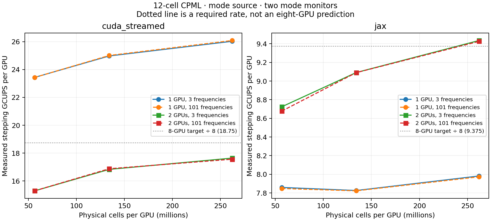

# Realistic modal H100 scaling implementation

The acceptance targets are 150 GCUPS with `cuda_streamed` and 75 GCUPS with
pure JAX on eight H100 SXMs. These remain targets, not measured results.
The available validation machine has two H100 SXM 80 GB GPUs with NV18 links.
RunPod returned `availability: NONE` for both four- and eight-device requests.
An actual secure-cloud eight-H100 allocation attempt at 17:13 UTC also failed
with HTTP 400: no instances available with the requested specifications.

## Matched fixed-domain controls

Both revisions use the same corrected harness and GPU-side setup on the same
two H100s. This isolates the runtime changes from the earlier harness retention
problem. The baseline runtime is `795c8c5`; only its two benchmark harness files
were updated, verified against 295 archived source hashes.

| Global shape | Backend | Before stepping | After stepping | Speedup | Before full call | After full call | Peak GiB before → after |
|---|---|---:|---:|---:|---:|---:|---:|
| 128x256x384 | cuda_streamed | 6.91 | 17.93 | 2.59× | 5.23 | 8.53 | 2.98 → 2.83 |
| 128x256x384 | jax | 6.03 | 11.06 | 1.83× | 4.93 | 7.49 | 2.37 → 2.65 |
| 512x512x512 | cuda_streamed | 9.41 | 31.89 | 3.39× | 7.41 | 17.27 | 27.89 → 26.18 |
| 512x512x512 | jax | 12.41 | 17.53 | 1.41× | 9.10 | 11.81 | 22.70 → 25.07 |

All throughput columns are GCUPS. “Full call” includes input placement, fresh
state allocation and result materialization, with compilation warmed. Peak GiB
sums per-device allocator peaks; it is not a simultaneous process-wide peak.

JAX uses about 10% more peak allocator memory in the 512³ control (12% in the
smaller control), alongside its throughput gain. CUDA reduces the measured peak
by about 6%. Host-built large-domain calls include additional CPU-to-GPU setup
cost and must not be compared directly against these GPU-setup API timings.

## Measured domain-size sweep

All rates below are total stepping GCUPS, using five synchronized samples.
For two GPUs, the global shape is `L×L×2L`; for one it is `L³`.

| Local side L | Cells/GPU (M) | Frequencies | CUDA, 1 GPU | CUDA, 2 GPUs | JAX, 1 GPU | JAX, 2 GPUs |
|---|---:|---:|---:|---:|---:|---:|
| 384 | 56.62 | 3 | 23.44 | 30.58 | 7.86 | 17.45 |
| 384 | 56.62 | 101 | 23.43 | 30.58 | 7.85 | 17.35 |
| 512 | 134.22 | 3 | 24.98 | 33.66 | 7.83 | 18.18 |
| 512 | 134.22 | 101 | 25.01 | 33.75 | 7.82 | 18.18 |
| 640 | 262.14 | 3 | 26.03 | 35.28 | 7.98 | 18.87 |
| 640 | 262.14 | 101 | 26.09 | 35.12 | 7.97 | 18.85 |



At the largest tested local volume, CUDA provides 17.64 GCUPS per GPU on two
devices, below the 18.75 required for 150 across eight. JAX provides 9.44, only
slightly above the required 9.375, before any additional eight-device overhead.
CUDA needs at least another 6.3% per-device improvement even before accounting
for additional eight-device costs; JAX has only about 0.6% headroom. The targets
are therefore not established. Increasing local volume from 512³
to 640³ nearly doubles cells per GPU but adds only about 4–5% throughput.

JAX’s two-device rate exceeds twice its single-device rate because its distributed
local-stencil lowering differs from its single-device lowering. This does not
demonstrate superlinear scaling to additional devices.

The three-frequency rows use runtime `23defe1`; the 101-frequency rows use
`25cb11f`, with identical timed stepping code but before the post-scan publication
layout fix. Both use the corrected buffer-lifetime protocol and full-state
synchronization. Use the final matched controls for public API latency and memory
comparisons. Earlier trials, including both failed largest-domain trials, remain
in the raw archive and the all-variants CSV.

## Planar-domain check

For a `128×1024×2048` domain (268.44 million cells), two H100s and 101
frequencies, CUDA measured **31.70 GCUPS** and JAX **17.02 GCUPS**.
The same cell count arranged as `512×512×1024` measured 33.75 and 18.18.
The thinner shape has more CPML volume relative to its interior; domain shape
matters alongside total cells. Its host-built full-call rates were
4.34 and 4.79 GCUPS respectively, including placement and allocation.

## Implementation

- Normal CPML recurrence arrays retain owner-local state during the timestep
  scan. Public continuation state is assembled at the scan boundary.
- Pure JAX uses explicit one-cell tangential-field exchanges and local CPML
  arithmetic for uniform diagonal 3D CPML cases. Unsupported configurations
  retain the existing JAX implementation. This path does not call native CUDA.
- Distributed CUDA uses specialized uniform FP32 CPML arithmetic, with a bulk
  stencil that avoids CPML indexing. General metrics, asymmetric CPML, tensors
  and other supported cases retain their general implementation.
- ABI 20 passes the six lower/upper source faces separately from owned fields,
  removing field-sized halo concatenations. Rebuild `beamz-cuda-component`
  version 0.20.0 with the Python changes; the ABI check rejects older binaries.
- The sharded FFI handler advertises command-buffer capture compatibility.
  It only validates descriptors and enqueues kernels on XLA's stream.
- Crossing source patches and batches larger than two use explicit rank-local
  injection. CUDA also localizes single-owner sources, removing six small source reductions
  per mode-source timestep in the profiled case. Pure JAX retains its faster
  static-scatter lowering for sources contained on one rank.
- Host-side setup permits building the global domain without first fitting its
  complete setup allocation on GPU 0.
- For x-partitioned uniform FP32 CUDA CPML, a right-handed cyclic storage
  permutation makes the partition-normal dimension the native leading axis.
  This removes full-volume layout conversions inside the scan. Fields,
  components, CPML state, metrics and halo faces rotate together; physical
  source/monitor ordering and the public state layout remain unchanged.
- Proven interior sources allow skipping redundant whole-field PEC masks after
  injection. Boundary-touching or irregular sources retain the masks.
- Warmup outputs are released before measuring subsequent runs, avoiding an
  unused retained state in the reported allocator peak.
- The harness releases standalone timing inputs before public API samples and
  captures only the final output for finite-state validation. Previously, its
  retained inputs/outputs caused the largest two-device trials to run out of
  memory during repeated public calls. Those failed trials remain in the raw
  evidence and are excluded from accepted throughput measurements.
- Cropping the backend padding previously replicated whole public field arrays
  on every device. Published fields now retain explicit distributed storage:
  the solver axis when the physical extent divides the device count, otherwise
  another divisible axis. Public shapes and values are unchanged. Continuation
  restores the solver layout once at the next scan boundary. Shapes with no
  divisible physical axis retain the existing fallback.

## Reproduction and interpretation

```sh
python scripts/benchmark_modal_scaling.py --host-setup --output /path/to/new-results
```

The default matrix covers 1/2/4/8 GPUs, local cubes 256³/384³/512³ for weak
scaling, global cubes 512³/768³/1024³ for strong scaling, and 3/101 frequencies.
The measured two-device matrix uses `--counts 1 2 --local-sizes 384 512 640
--cubes --frequencies 3 101 --max-wall-seconds 5400`. Each configuration runs in a fresh
process, with five synchronized warm samples. Setup and compilation are reported
separately. `--max-wall-seconds` bounds the sweep, not the GPU rental.

The modal worker synchronizes the complete state tree, including monitor
accumulators, for every sample. The standalone harness now does the same.

Every modal case uses 12-cell CPML, a mode source, two mode monitors, a binary
waveguide and 80 nm resolution. GCUPS counts physical material cells times full
Yee timesteps; it excludes padded cells and does not multiply by field components.
The fixed port aperture is 1.6 µm × 0.8 µm. Larger full-plane or many-port monitors
are different workloads. Enlarging a cube mostly adds cladding; the weak suite
lengthens one coupled waveguide, rather than running independent replicas.

The 256-step samples measure steady stepping overhead, and can precede pulse
arrival at distant monitors. Long propagated mode spectra are a separate gate:

```sh
python scripts/validate_modal_scaling.py --backend jax --devices 1 --output reference.json
python scripts/validate_modal_scaling.py --backend cuda_streamed --devices 2 --output cuda2.json
python scripts/compare_modal_scaling.py reference.json cuda2.json --output comparison.json
```

## Remaining scaling limits

Larger local domains amortize per-step launch and communication costs and reduce
the relative volume occupied by 12-cell CPML. They cannot guarantee linear
scaling: stencil traffic eventually saturates device memory bandwidth, halo
transfers remain on the dependency chain, and the current slab decomposition
exposes increasing interface area when local aspect ratios are unfavorable.
The separate-face CUDA change avoids copies; it does not by itself overlap
communication with interior computation. CUDA’s single-device native program
graph and distributed phase runner also use different execution plans, so the
per-device throughput gap cannot be attributed solely to communication.

At 85% eight-device efficiency, the targets require approximately 22.1 GCUPS
per GPU for CUDA and 11.0 for JAX on the same realistic workload. Acceptance
requires actual eight-device measurements and propagated-spectrum agreement.
Neither multiplying two-device throughput by four nor counting independent
simulations is sufficient.

## Same-node single-device control

For the 512³, three-frequency case, the final one-device sweep measured
24.976 GCUPS for CUDA and 7.826 for JAX, versus 24.797 and 7.821 respectively
at the starting commit. These results show no material single-device regression
in this control. Distributed improvements should not be interpreted as a new
single-device stencil speedup.

## Numerical validation

CPU validation passed four pure-JAX feature/gradient tests, eight CUDA
feature/storage tests and 36 ABI/backend contract tests. On the final deployed runtime,
six larger-grid GPU parity/continuation tests over x/y/z plus 18 extended
distributed CUDA GPU tests passed; six cases requiring four GPUs were skipped. Numerical tolerances were
not changed. Logs are retained with the evidence.

At 64×96×256, 2,048 steps, 12-cell CPML and 101 frequencies, both two-device
backends passed pointwise DFT and flux checks against single-device JAX using
`rtol=3e-5` and `atol=max(1e-12, 2e-6*max(abs(reference array)))`.
The maximum monitor-flux relative L2 errors were 3.84e-7 for JAX and 4.68e-7
for distributed CUDA. Both monitors received a nonzero signal and all state
arrays were finite.

At `128×512×1024`, 4,096 steps and 101 frequencies, both distributed
backends also passed every pointwise DFT, weight and flux comparison. Maximum
relative L2 DFT/flux errors were 5.47e-7 / 5.93e-7 for JAX and
5.09e-7 / 3.94e-7 for CUDA. All final state arrays were finite and both monitors
received nonzero spectra. See `large-distributed-spectra.json`.

The single-device CUDA control has a pre-existing long-run DFT discrepancy:
its flux passes that tolerance, but some raw DFT entries do not. Its new and
pre-change DFT/flux artifacts are bit-for-bit identical. The relative L2 DFT
error against JAX is about 5.6e-6. This is recorded separately, not hidden by
loosening the check; see `single-cuda-vs-jax.json` and
`single-cuda-nonregression.json`.

The larger 4,096-step single-device CUDA case also fails raw DFT checks and one
pointwise flux check: maximum relative L2 errors are 3.28e-5 for DFT and 1.23e-5
for flux. Replaying the original runtime and original native binary on the same
large case produced bit-for-bit identical DFT/flux arrays. This is a confirmed
existing discrepancy, not a new regression, and remains an open numerical issue.
See `large-single-cuda-vs-jax.json` and `large-single-cuda-nonregression.json`.

## Profiling and rejected alternatives

The intermediate two-device, 128×256×384 CUDA profile attributes 46.2% of summed
GPU event duration to native stencil/CPML kernels, 15.6% to NCCL, 9.8% to copies,
and 28.4% to other kernels. These are event-duration sums, not wall-time shares;
concurrent GPU activity can overlap. Optimized HLO shows two combined halo
exchanges per timestep, six small source reductions, and two monitor reductions.
The CPML continuation reduction occurs outside the timestep loop. The final
source policy removes the six source reductions from the CUDA stepping path.

Explicitly adding `COLLECTIVES` and `WHILE` command-buffer categories did not
justify a default change: the intermediate medium CUDA result was 10.9057 GCUPS
without versus 10.9371 with the flags; JAX was 10.2963 versus 10.0953. The native
capture-compatibility declaration remains, but no global XLA flags are changed.

The final CUDA profile (same medium case, 32 profiled steps) attributes 58.1%
of summed GPU event duration to stencil/CPML kernels, 20.0% to NCCL, 1.7% to
copies and 20.3% to other kernels. Two monitor reductions per step remain;
source reductions have disappeared. These percentages do not estimate the
speedup possible from overlapping communication.

Per-thread bulk/shell selection and a separate exact rectangular bulk launch
were slower than the retained single-launch tile selection. Forcing row-major
layouts across the distributed scan also regressed both backends and was
reverted. The retained cyclic CUDA storage transform solves the specific native
layout mismatch without constraining all JAX intermediates.

## Provenance, budget and teardown

Runtime commit: `23defe1`, on `bench/h100-backend-comparison`. Earlier runtime
and harness snapshots are retained alongside every measured variant. The final
118-file deployment manifest matched the local checkout exactly. Native ABI 20
uses the archived 0.20.0 wheel; its installed binary hash matches the wheel payload.
The original ABI 19 binary was restored only for isolated baseline runs.

Environment: Python 3.12.3, JAX/jaxlib 0.9.0, driver 580.159.04, two full H100
80 GB devices linked by NV18. Fields and CPML state are FP32. CUDA flags are
128 (graph cache). `NCCL_NVLS_ENABLE=0` was required on this node; preallocation
was disabled and the allocator fraction was 0.80. No global command-buffer
category override was enabled.

The [evidence manifest](h100-modal-scaling/manifest.json) records source and
binary hashes, capacity reads and teardown. The [all-variants CSV](h100-modal-scaling/measurements.csv)
includes rejected experiments; the [selected curve data](h100-modal-scaling/final-measurements.csv)
and [matched controls](h100-modal-scaling/matched-controls.csv) identify the
measurements used above. Full JSONs, logs, spectra, HLO/profiler traces, source
snapshots and wheels are retained locally in
`benchmarks/results/h100-modal-20260925-evidence.tar.gz` (not committed).
All 349 remote evidence-file hashes were checked against the local copies before
termination. Archive SHA256:

```text
8e8d99664240fbc4c832f90a57218e1fc9350995b1b74fd62889ed61c43de6c3
```

The pod `93njfmkf0pwq2o` was terminated at 2026-09-25T20:26:36Z;
a subsequent read returned 404. Estimated compute for this pod is
$32.30; including the earlier $36.93 estimate, total compute is
**$69.23 against the $175 cap**. This is an estimate from elapsed time and
the quoted $6.98/hour rate. Four- and eight-H100 SXM capacity remained `NONE`
after teardown. The eight-device throughput targets remain unverified.
