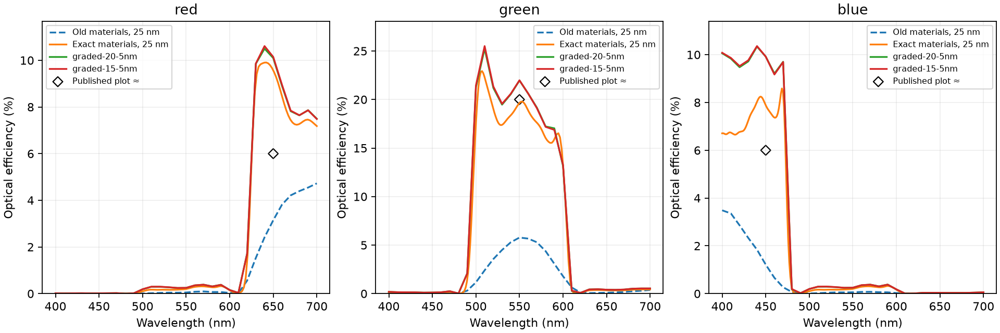

# CMOS reference parity on the local RTX 3090

The revised notebook imports the exact dispersive models embedded in the public
[Tidy3D CMOS example](https://www.flexcompute.com/tidy3d/examples/notebooks/CMOSRGBSensor/).
It measures 200 frequencies in one broadband device run plus an empty-cell
reference and plots total electric-field intensity relative to incident intensity.
The saved notebook executed all six code cells without errors.

## Corrected assumptions

- **RGB filters:** previous passband k values near 0.06–0.08 were much too lossy.
  Exact reference values at 650/550/450 nm are approximately 0.00917, 0.00904,
  and 0.01016. The default no longer uses the restricted positive-Lorentz fit.
  An import check requires k <= 0.02 over the target transparent bands.
- **Aluminum:** the reference's four-real-pole `Al_Rakic1995` differs from the
  five-pair library variant previously imported under the same name. All seven
  media are now imported from the same embedded simulation snapshot. The raw
  snapshot, source URL, checksums, and old material models are preserved in
  `examples/data/cmos_rgb`.
- **Fields:** all three E components are colocated, summed as |E|², and divided by
  the empty-cell incident |E|². Each three-wavelength plot shares a color scale.
  This corrects the old Ex-only comparison; absolute display units still differ
  from the reference webpage.
- **Grid and source:** full-aperture normal plane waves now support rectilinear
  meshes through metric-aware TF/SF sheets and time-shifted E/H waveforms. The
  source rejects dispersive/lossy injection sheets. Centered mesh overrides now
  shift together with geometry. Graded reference runs reuse the exact sensor
  grid and timestep, instead of remeshing an empty design.
- **Flux and interfaces:** rectilinear aperture integration clips fractional boundary cells.
  Uniform monitor integration now uses the exact aperture area, removing an
  erroneous endpoint correction applied to cell-center samples.
  Periodic dispersive seams use physical support-volume weights. Scalar volume
  averaging remains the interface approximation; this is not a new conformal
  or tensor-dispersion method.

## Results and limits



At 650/550/450 nm, respectively, the old 25 nm notebook gave red 3.15%, green
5.78%, blue 1.22%. The revised 25 nm notebook gives **9.57%, 19.64%, 7.89%**.
The published plot is approximately **6%, 20%, 6%** at those wavelengths.
Those published numbers are visual estimates, not exported Tidy3D flux arrays.
Material parity therefore fixes the excessive absorption but **does not establish
full solver agreement**. In particular red and blue remain higher.

The 20 nm lateral / 5 nm depth-refined run has 154 × 154 × 509 cells and gives
10.10%, 21.96%, 9.92% at the same wavelengths. The 15 nm lateral run uses
202 × 202 × 509 cells and gives **10.15%, 21.98%, 9.92%**. Refining lateral
spacing from 20 to 15 nm changes the full spectra by at most **0.11, 0.28, and
0.05 percentage points**, respectively. This is much smaller than the remaining
reference mismatch. Both runs retained finite fields and polarization. Their
150-to-300 fs raw-flux changes are smaller than the reference discrepancies,
but are not a complete acquisition-time convergence study. `summary.json`
contains the spectra comparison and run metadata. Differences between the uniform notebook and graded
runs also include different timesteps, acquisition lengths, and sampling grids;
they are not a clean one-parameter convergence study.

Timing logs include compilation and contention from validation jobs on the same
GPU; they are not standalone performance benchmarks. A simultaneous 15 nm device
and reference attempt exhausted 24 GB VRAM. Finer device/reference runs must be
executed sequentially. The successful 15 nm device run took 90.7 seconds to set
up and 1241.9 seconds to advance 40,590 steps; its empty reference took 337.2
seconds to advance. Both ran on the local RTX 3090.

## Independent checks

- A 97-test regression suite passed, followed by 87 targeted tests after the
  uniform-aperture correction (overlapping coverage). These include material
  response, automatic grids, plotting, source behavior, geometry, coordinates,
  continuation, API contracts, mode-launch power, and edge cases. The final
  regression suites ran on CPU; the documented FDTD validation runs used the GPU.
- For graded plane waves in all six directions, measured incident power is
  within 2% of the request and backward flux is below 1e-4 of unit power over
  the test frequencies. Empty-cell calibration removes the incident-spectrum
  error from the sensor efficiency.
- Exact RGB filter films and the silica/SiN/aSi stack were checked against
  transfer-matrix optics on GPU. At 5 nm, the maximum transmission error among
  those four cases is 1.63 percentage points; the stack's maximum reflection
  error is 0.66 percentage points. See `planar/report.json`.
- The embedded aluminum and aSi films were checked at 5 and 2.5 nm. At 2.5 nm,
  maximum reflection errors are 0.320 and 0.223 percentage points, respectively.
  Both have positive absorption throughout the band. See `slabs/report.json`.
- Interface placement matters: an air/aSi flux monitor exactly on the interface
  has a maximum transmission error of 3.07 percentage points at 5 nm and 1.69
  at 2.5 nm. At a plane three cells inside silicon, comparison with the exact
  attenuated flux reduces those errors to 0.156 and 0.085 percentage points.
  This identifies an interface-colocation error that remains to be improved;
  it must not be disguised by moving the sensor's measurement plane.
- Doubling the absorber thickness from 250 to 500 nm in that interface test
  changes transmission by at most 0.012 percentage points. This checks that
  planar test, not the complete sensor's boundary convergence.

## Remaining work toward numerical agreement

1. Improve Yee-field colocation for flux exactly at a dispersive dielectric
   interface, using the planar interface test as the acceptance case. Preserve
   the reference detector plane and compare against the correct interface flux.
2. Refine the depth and interface treatment next. The 20-to-15 nm lateral
   comparison has small changes, so lateral spacing alone does not explain
   the residual mismatch. Curved-boundary or anisotropic interface methods
   need independent validation before adoption.
3. Export numerical Tidy3D monitor spectra and its realized grid to replace
   visual plot estimates with wavelength-by-wavelength errors. The material
   snapshot is exact, but the plotted reference outputs are not numerical data.
4. Once the spatial error is controlled, check the complete sensor's absorber
   thickness and acquisition-time convergence with fixed geometry and monitors.

## Reproduce

```bash
.venv/bin/python scripts/validation/import_cmos_reference.py
XLA_PYTHON_CLIENT_PREALLOCATE=false OPENBLAS_NUM_THREADS=1 .venv/bin/python scripts/validation/cmos_planar_checks.py
XLA_PYTHON_CLIENT_PREALLOCATE=false OPENBLAS_NUM_THREADS=1 .venv/bin/python scripts/validation/cmos_interface_checks.py
XLA_PYTHON_CLIENT_PREALLOCATE=false OPENBLAS_NUM_THREADS=1 .venv/bin/python scripts/validation/run_cmos_broadband.py --graded --dx-nm 20 --metal-nm 5 --output docs/reviews/cmos-reference-parity
XLA_PYTHON_CLIENT_PREALLOCATE=false OPENBLAS_NUM_THREADS=1 .venv/bin/python scripts/validation/run_cmos_broadband.py --graded --dx-nm 20 --metal-nm 5 --reference --output docs/reviews/cmos-reference-parity
XLA_PYTHON_CLIENT_PREALLOCATE=false OPENBLAS_NUM_THREADS=1 .venv/bin/python scripts/validation/run_cmos_broadband.py --graded --dx-nm 15 --metal-nm 5 --no-fields --output docs/reviews/cmos-reference-parity
XLA_PYTHON_CLIENT_PREALLOCATE=false OPENBLAS_NUM_THREADS=1 .venv/bin/python scripts/validation/run_cmos_broadband.py --graded --dx-nm 15 --metal-nm 5 --no-fields --reference --output docs/reviews/cmos-reference-parity
.venv/bin/python scripts/validation/execute_cmos_notebook.py
.venv/bin/python scripts/validation/summarize_cmos_parity.py
```

Inspect `examples/notebooks/cmos_rgb_sensor.ipynb` for executed output. Increase
lateral resolution separately from metal-depth resolution; do not infer full
convergence from material/slab tests or a finite simulation alone.
