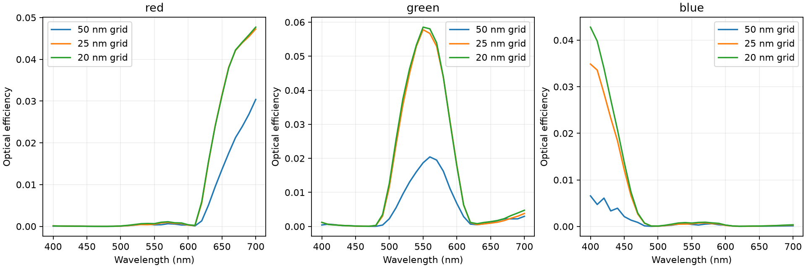

# Local RTX 3090 broadband dispersion validation

The CMOS sensor now measures all 31 wavelengths from 400–700 nm in one broadband device simulation. A second, empty-cell broadband simulation calibrates the incident spectrum. The separate mesh runs below are convergence checks, not wavelength sweeps.

## Implementation

- Scalar causal pole-residue materials, Drude/Lorentz constructors, spectral evaluation, JSON model import/export, and passive Lorentz fitting of n,k data.
- Coupled trapezoidal auxiliary-polarization updates in single-device JAX, including continuation state, volume-averaged material ownership, and periodic seams.
- Reference Al/Rakic1995, aSi/Horiba, SiN/Horiba, and SiO2/Palik_LowLoss coefficients, plus passive fits to the reference RGB CSV data.
- Uniform normal-incidence plane-wave injection; fixed the source compiler's obsolete Yee dimensions.
- Fixed the notebook's misplaced shield opening and partial-run source normalization.
- Reused PR #233's zero-phase periodic boundaries and ported them to this checkout.

## Completed sensor runs

All use the local NVIDIA RTX 3090, JAX, float32 fields, complex64 polarization, 300 fs runtime, and Courant factor 0.7. The geometry is 3 × 3 × approximately 7.11 µm. Each acquisition collects 31 flux frequencies and three RGB field frequencies. All final field and polarization arrays were finite.

| Grid spacing | Grid cells (x × y × z) | Steps | Setup | Two advance calls | Largest 150-to-300 fs pixel-flux change |
| --- | --- | --- | --- | --- | --- |
| 50 nm | 60 × 60 × 143 | 4,452 | 5.6 s | 12.6 s | 0.0100 pp |
| 25 nm | 120 × 120 × 285 | 8,903 | 18.9 s | 80.8 s | 0.0087 pp |
| 20 nm | 150 × 150 × 356 | 11,128 | 29.5 s | 182.7 s | 0.0073 pp |

Setup includes rasterization and coefficient preparation. The advance-call timings include JIT compilation and result extraction; they are not isolated kernel timings. Temporal changes are in source-normalized unit-power fractions, expressed as percentage points. Calibration and the final channel spectra are saved separately.



The 25-to-20 nm maximum absolute optical-efficiency changes are 0.0456 percentage points for red, 0.1776 for the combined green channel, and 0.7926 for blue. The red/green curves agree much more closely than at 50 nm. **The full sensor is not established as spatially converged, especially at blue wavelengths.** Further refinement or an efficient locally refined plane-wave grid is needed for quantitative detector design. These results also do not establish agreement with the entire Tidy3D simulation.

The filter targets are hypothetical. The nine-oscillator positive-strength fits have RMS k errors of 0.0354 (red), 0.0611 (green), and 0.0471 (blue). Their fitted n differs from the artificial constant-n target to preserve causality. Inspect [filter fits](../../../examples/data/cmos_rgb/filter_fits.png) and the accompanying error JSON before interpreting absolute efficiency.

## Physics and regression checks

Analytical slab comparisons cover broadband aluminum and amorphous-silicon thin films, with reflection, transmission, positive absorption, and mesh refinement. Exact results and errors are in [slab report](slabs/report.json); [slab comparison](slabs/slabs.png) plots numerical and analytical spectra.

273 focused tests passed: 218 material/raster/source/periodic/API tests, two additional unsupported-path/imported-scene checks, 52 continuation/API/plotting compatibility tests, and one auxiliary-polarization memory-accounting check. The log files alongside this report preserve the individual runs. Tests cover analytic Drude/Lorentz susceptibility, driven ADE response, both 2D polarizations, uninterrupted versus continued evolution, painter-order ownership, periodic seam fractions, source normalization, and broadband slab optics.


At 2.5 nm slab resolution, maximum absolute reflection errors were 0.243 percentage points (aluminum), 0.223 percentage points (silicon). Both materials retained positive absorption across the sampled band.

The checked-in [CMOS notebook](../../../examples/notebooks/cmos_rgb_sensor.ipynb) executed end to end on the RTX 3090 in 122.3 seconds: six code cells, zero errors. Its stored outputs include the material-fit plots, geometry, calibrated efficiency, and RGB field maps. This execution used the 25 nm default grid and two broadband runs.

## Reproduce

From the repository root, with the project installed and CUDA-enabled JAX:

```bash
XLA_PYTHON_CLIENT_PREALLOCATE=false OPENBLAS_NUM_THREADS=1 .venv/bin/python scripts/validation/run_cmos_broadband.py --dx-nm 25
XLA_PYTHON_CLIENT_PREALLOCATE=false OPENBLAS_NUM_THREADS=1 .venv/bin/python scripts/validation/run_cmos_broadband.py --dx-nm 25 --reference
.venv/bin/python scripts/validation/summarize_cmos_broadband.py
XLA_PYTHON_CLIENT_PREALLOCATE=false OPENBLAS_NUM_THREADS=1 .venv/bin/python scripts/validation/dispersive_slabs.py
.venv/bin/python scripts/validation/execute_cmos_notebook.py
```

The notebook runner uses the current Python executable as its kernel and requires the development notebook dependencies (`nbclient`, `ipykernel`). The notebook and CLI use the same geometry builder. Environment versions are in [environment.json](environment.json). Material sources, validity bands, and license notices are in `examples/data/cmos_rgb`.

Native CUDA kernels, multi-device dispersion, full-tensor dispersion, dispersive mode sources/monitors, and automatic material-energy termination remain unsupported and are rejected explicitly. The current plane-wave source requires an isotropic grid. Static volume averaging is a convergent baseline, not a dispersive conformal-interface scheme.

## Superseded notebook/material defaults

The historical runs above retain their original approximate RGB fits and
library aluminum variant. The notebook and default materials were subsequently
updated to the exact models embedded in the published reference. See
[reference-parity improvements](../cmos-reference-parity/README.md) for the latest
executed notebook, validation, and remaining discrepancies. Do not combine the
old sensor spectra with new-material device spectra without labeling the change.
