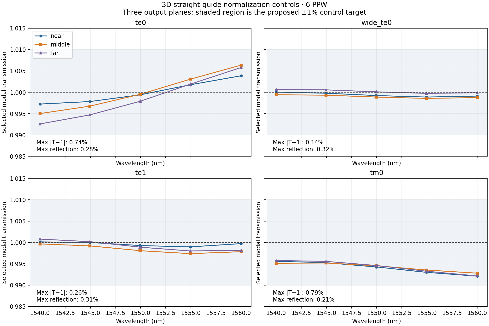
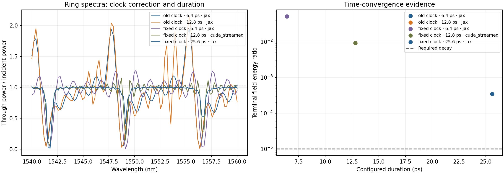

# PR #245 controlled experiments

Fresh RTX 3090 runs using JAX 0.9.0/CUDA 12, Python 3.11.15, at code revision
`9641d493`. These experiments use the pinned silicon/silica indices, 220-nm core,
source pulse, three source frequency profiles, five mode candidates, and
Farjadpour diagonal smoothing. The TM0 control additionally uses nitride upper
cladding. Each run adds an exact 1550-nm sample to the original five frequencies.



| Guide / launched mode | Maximum transmission error | Maximum reflection | Maximum output-plane power spread |
|---|---:|---:|---:|
| 500 nm / TE0 | 0.7404% | 0.2759% | 0.4654 percentage points |
| 1200 nm / TE0 | 0.1421% | 0.3164% | 0.1247 percentage points |
| 1200 nm / TE1 | 0.2604% | 0.3098% | 0.1895 percentage points |
| 405 nm / TM0, nitride top | 0.7881% | 0.2093% | 0.0701 percentage points |

All four meet the investigation's proposed 1% transmission, reflection, and
monitor-distance controls. The maximum modal-versus-integrated-flux discrepancy
is 0.1261% of incident power. These are independently meshed 12-µm straight
guides, not full-device-grid controls; they rule out a gross normalization error
in these simple geometries but do not establish validity of device-local modal
extraction. The three output monitors are alternative measurements of one guide
and must not be added together as physical outputs.

`runs.json` preserves complete scalar and spectral summaries, exact options,
code revisions, raw artifact paths, and SHA-256 hashes. The named NPZ files
retain complex S parameters, forward/backward modal amplitudes, flux checks,
projection residuals, conditioning, effective indices, and realized grid edges.
Full raw monitor fields and geometry/field plots remain at the recorded local
artifact paths. A preliminary duplicate TE0 run is excluded from this evidence.

Reproduce one control from the repository root:

```sh
XLA_PYTHON_CLIENT_PREALLOCATE=false uv run --no-sync python \
  -m scripts.investigate_passive_soi straight_te1 --exact-center \
  --output validation-artifacts/pr245/te1-new
```

Replace `straight_te1` with `straight_te0`, `straight_wide_te0`, or `straight_tm0`.
Use a new output directory for every experiment. The `--no-sync` flag preserves
an explicitly installed CUDA-enabled JAX environment.
Regenerate the figure using `python tests/differential/results/pr245-controls/plot_results.py`.

AI-assisted implementation, experiments, and analysis: OpenAI Codex.

## Long-run clock defect: confirmed and fixed

The original JAX loop repeatedly added `dt` to a float32 clock. The source is
indexed by integer steps, while monitor DFT phases used this drifting clock.
The new 60,000-step regression fails on the original implementation with
0.530862 radians of optical phase error. Commit `1e3f217b` derives timestamps
from the request origin and absolute integer step, including continuation chunks.
51 engine/runtime checks and 29 CUDA hardware parity checks passed.

At fixed converter geometry and source, the dense 22-frequency JAX run now has
maximum selected output power **1.019153**, below the existing **1.02** bound.
The old native backend, which already avoided per-step clock accumulation,
gives 1.019145; the maximum selected-channel spectral difference is 0.0000155.
The original five-frequency hardware test also passes after removing its xfail
(1 passed, 10 deselected). Conversion at exact 1550 nm is 0.218416; this does
**not** establish agreement with the converged paper reference.



At 6.4 ps the corrected ring linewidth changes from 3.823824 to 0.960961 nm,
and Q from 403.46 to 1604.35. This isolates a major spectral error, but the
corrected run still has field decay 0.051106 and selected output maximum
1.273292. Its spectral metrics remain provisional. The old-clock 12.8-ps run
is retained to show that simply running longer does not cure the clock defect.
An obsolete-clock 25.6-ps experiment was stopped after identifying the defect;
it has no completed result and is excluded here.

The selected output bound is a necessary check on retained modes, not a complete
all-mode energy balance. Straight controls above predate the clock correction;
they should be repeated if used as final release evidence. Some device runs
shared the GPU, so their timings are not suitable for performance comparisons.

## Port-termination intervention is distinct from paper reproduction

The narrow converter ports sit 11.858 µm from the corresponding x-domain edges.
Their pinned 10-µm extensions therefore end 1.858 µm from the edge, **0.858 µm
before the 1-µm absorber**. The source repository has the same behavior:
[`extend_from_ports`](https://github.com/JPPhotonics/fdtd-pipeline/blob/622e0a9b7429eaf2335b1000b39e283544a198c4/helper_functions/generic/gds_handling.py#L32)
uses fixed-length stubs, and
[`initiate_fdtd`](https://github.com/JPPhotonics/fdtd-pipeline/blob/622e0a9b7429eaf2335b1000b39e283544a198c4/helper_functions/tidy3d/initiate_fdtd.py#L98)
derives domain limits from the original ports. This is a physical limitation of
the pinned setup, not uniquely a BeamZ adaptation error.

The default `--port-extension-policy reference` deliberately preserves that
setup. `--port-extension-policy through_boundary` extends all port guides beyond
the domain edge. The latter is a controlled physical correction and must not be
called a reproduction of the exact paper geometry. Its reference acceptance is
ineligible in the experiment report. `--grid-from PATH/monitor_data.npz` keeps a
recorded mesh fixed when comparing this intervention with the original setup.
The geometry guard fails on the original converter and passes for the corrected
variant; it is not evidence by itself of the spectral size of this effect.
