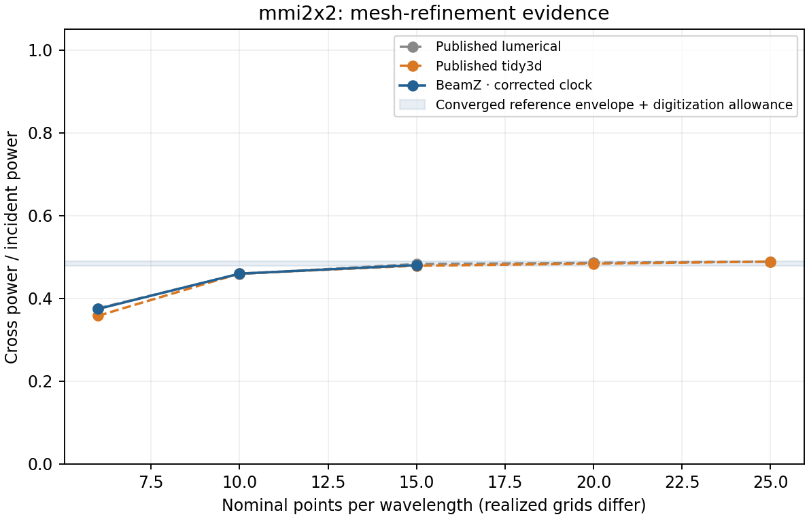
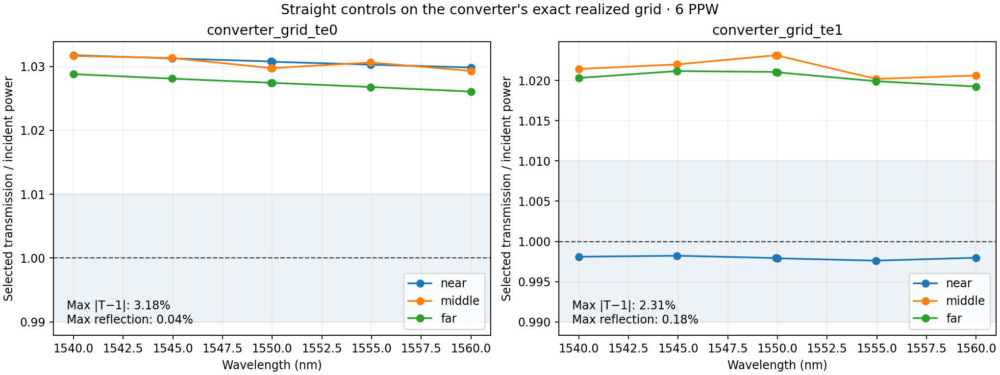
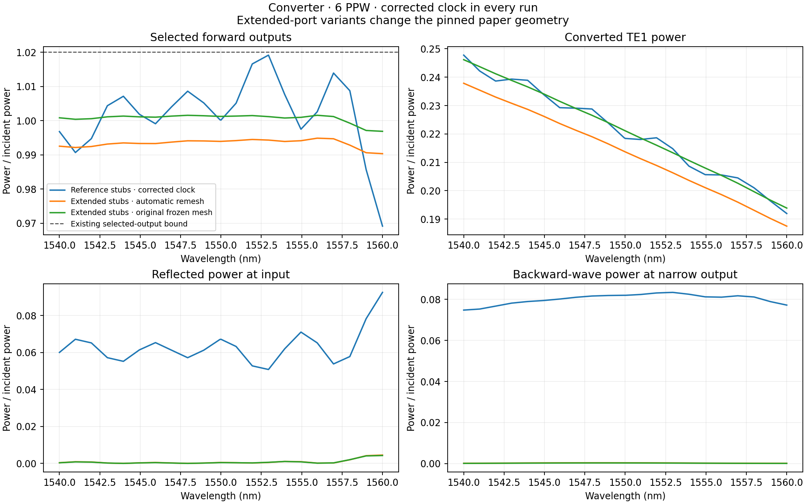

# PR #245 controlled experiments

Fresh RTX 3090 runs using JAX 0.9.0/CUDA 12, Python 3.11.15, at code revision
`9641d493`. These experiments use the pinned silicon/silica indices, 220-nm core,
source pulse, three source frequency profiles, five mode candidates, and
Farjadpour diagonal smoothing. The TM0 control additionally uses nitride upper
cladding. Each run adds an exact 1550-nm sample to the original five frequencies.


| Guide / launched mode | Maximum transmission error | Maximum reflection | Maximum output-plane power spread |
|---|---:|---:|---:|
| 500 nm / TE0 | 0.7404% | 0.2759% | 0.4654 percentage points |
| 1200 nm / TE0 | 0.1421% | 0.3164% | 0.1247 percentage points |
| 1200 nm / TE1 | 0.2604% | 0.3098% | 0.1895 percentage points |
| 405 nm / TM0, nitride top | 0.7881% | 0.2093% | 0.0701 percentage points |

All four meet the investigation's proposed 1% transmission, reflection, and
monitor-distance controls. The maximum modal-versus-integrated-flux discrepancy
is 0.1261% of incident power. These are independently meshed 12-µm straight
guides, not full-device-grid controls; they rule out a gross normalization error
in these simple geometries but do not establish validity of device-local modal
extraction. The three output monitors are alternative measurements of one guide
and must not be added together as physical outputs.

`runs.json` preserves complete scalar and spectral summaries, exact options,
code revisions, raw artifact paths, and SHA-256 hashes. The named NPZ files
retain complex S parameters, forward/backward modal amplitudes, flux checks,
projection residuals, conditioning, effective indices, and realized grid edges.
Full raw monitor fields and geometry/field plots remain at the recorded local
artifact paths. A preliminary duplicate TE0 run is excluded from this evidence.

Reproduce one control from the repository root:

```sh
XLA_PYTHON_CLIENT_PREALLOCATE=false uv run --no-sync python \
  -m scripts.investigate_passive_soi straight_te1 --exact-center \
  --output validation-artifacts/pr245/te1-new
```

Replace `straight_te1` with `straight_te0`, `straight_wide_te0`, or `straight_tm0`.
Use a new output directory for every experiment. The `--no-sync` flag preserves
an explicitly installed CUDA-enabled JAX environment.
Regenerate the figure using `python tests/differential/results/pr245-controls/plot_results.py`.

AI-assisted implementation, experiments, and analysis: OpenAI Codex.

## Long-run clock defect: confirmed and fixed

The original JAX loop repeatedly added `dt` to a float32 clock. The source is
indexed by integer steps, while monitor DFT phases used this drifting clock.
The new 60,000-step regression fails on the original implementation with
0.530862 radians of optical phase error. Commit `1e3f217b` derives timestamps
from the request origin and absolute integer step, including continuation chunks.
51 engine/runtime checks and 29 CUDA hardware parity checks passed.

At fixed converter geometry and source, the dense 22-frequency JAX run now has
maximum selected output power **1.019153**, below the existing **1.02** bound.
The old native backend, which already avoided per-step clock accumulation,
gives 1.019145; the maximum selected-channel spectral difference is 0.0000155.
The original five-frequency hardware test also passes after removing its xfail
(1 passed, 10 deselected). Conversion at exact 1550 nm is 0.218416; this does
**not** establish agreement with the converged paper reference.


At 6.4 ps the corrected ring linewidth changes from 3.823824 to 0.960961 nm,
and Q from 403.46 to 1604.35. This isolates a major spectral error, but the
corrected run still has field decay 0.051106 and selected output maximum
1.273292. Its spectral metrics remain provisional. The old-clock 12.8-ps run
is retained to show that simply running longer does not cure the clock defect.
An obsolete-clock 25.6-ps experiment was stopped after identifying the defect;
it has no completed result and is excluded here.

The selected output bound is a necessary check on retained modes, not a complete
all-mode energy balance. Straight controls above predate the clock correction;
they should be repeated if used as final release evidence. Some device runs
shared the GPU, so their timings are not suitable for performance comparisons.

## Port-termination intervention is distinct from paper reproduction

The narrow converter ports sit 11.858 µm from the corresponding x-domain edges.
Their pinned 10-µm extensions therefore end 1.858 µm from the edge, **0.858 µm
before the 1-µm absorber**. The source repository has the same behavior:
[`extend_from_ports`](https://github.com/JPPhotonics/fdtd-pipeline/blob/622e0a9b7429eaf2335b1000b39e283544a198c4/helper_functions/generic/gds_handling.py#L32)
uses fixed-length stubs, and
[`initiate_fdtd`](https://github.com/JPPhotonics/fdtd-pipeline/blob/622e0a9b7429eaf2335b1000b39e283544a198c4/helper_functions/tidy3d/initiate_fdtd.py#L98)
derives domain limits from the original ports. This is a physical limitation of
the pinned setup, not uniquely a BeamZ adaptation error.

The default `--port-extension-policy reference` deliberately preserves that
setup. `--port-extension-policy through_boundary` extends all port guides beyond
the domain edge. The latter is a controlled physical correction and must not be
called a reproduction of the exact paper geometry. Its reference acceptance is
ineligible in the experiment report. `--grid-from PATH/monitor_data.npz` keeps a
recorded mesh fixed when comparing this intervention with the original setup.
The geometry guard fails on the original converter and passes for the corrected
variant; it is not evidence by itself of the spectral size of this effect.

## Mesh and full-grid checks



| MMI PPW | BeamZ cross power at exact 1550 nm | Published same-PPW range | Peak process host RSS |
|---|---:|---:|---:|
| 6 | 0.374458 | 0.358–0.376 | 2.98 GiB |
| 10 | 0.459865 | 0.459–0.460 | 5.80 GiB |
| 15 | 0.480377 | 0.479–0.483 | 13.10 GiB |

The 15-PPW point also enters the independently declared converged-reference
interval 0.478–0.490. The change from 10 to 15 PPW is still 0.02051, so this is
reference agreement at one eligible resolution, not established BeamZ mesh
convergence. All three runs satisfy decay and selected-output bounds.



Straight guides on the original converter's exact 971×123×27 grid fail the
proposed 1% transmission calibration: TE0 reaches 3.18% error and TE1 2.31%.
Maximum reflected powers are only 0.042% and 0.176%, respectively. TE1 varies
by 2.52 percentage points between output planes. The earlier independent-grid
controls therefore do not validate this device's measurement geometry. This
requires refinement and a closer audit of staggered-field sampling and modal
projection before treating percent-level spectral differences as physical.



With extended stubs and automatic remeshing, maximum selected converter output
falls to 0.99486; narrow-output backward power falls from 0.08343 to 0.000377.
Input reflection falls from 0.09250 to 0.00452. Conversion at 1550 nm changes
from 0.21842 to 0.21368, remaining far from the converged paper range. The
original and corrected automatic meshes differ (971 versus 969 x cells), so
this comparison alone does not isolate the geometric intervention.

The reference geometry's selected outputs plus input reflection reach 1.06995.
Backward waves arriving from other ports make that a multiple-incidence problem,
not evidence that missing output modes somehow explain excess power. Passing
the selected-output-only 1.02 check is insufficient to establish an open-port
scattering matrix. The extended-stub variant is a separate diagnostic, not a
way to tune the published conversion target.

The follow-up `converter-ports-fixed-frozen6` preserves **every grid edge** from
the reference-stub run (verified by array equality). Output backward-wave power
falls to **0.000291**, input reflection to **0.00427**, and selected outputs plus
input reflection to **1.00181**. Conversion is **0.22110** at 1550 nm. This
isolates the truncation effect from remeshing: it largely explains the spurious
returning waves but does not explain the gap to converged reference conversion.

A no-fit analytic sampling check provides a concrete lead for the 6-PPW control
error. Linear normal-direction interpolation attenuates E and H differently
according to a monitor's fractional position between Yee planes. Using recorded
grid edges, monitor positions, and modal neff, the single-mode model predicts
TE0 near-plane transmission about 1.033 versus measured 1.031, and TE1 middle
transmission about 1.023 versus measured 1.023. Across all retained wavelengths
and planes, prediction errors stay below 0.98 percentage points. See
`diagnose_plane_sampling.py` and `plane_sampling_analysis.json`.

This supports auditing the modal basis against the **same interpolation applied
to measured fields**, with correct forward/backward phases and power
normalization. It does not validate a scalar post-hoc correction: the model
omits discrete dispersion, vector impedance errors, radiation, and attenuation.
The measured data and acceptance thresholds are unchanged.

## Normal-direction modal sampling: fixed

Commit `d0fef56e` applies the monitor's normal-direction interpolation to each
power-normalized forward/backward modal basis, using the mode's discrete
propagation constant. The basis is **not renormalized after sampling**. Nine
independent analytic-wave cases use the actual 3D monitor compiler on all three
axes and multiple fractional plane positions, and recover both traveling-wave
amplitudes to 1e-12. Together with modal, placement, and result-contract checks,
41 targeted checks pass.


Reprojecting the retained full-grid control fields gives TE1 maximum transmission
error **0.7031%**, down from 2.3139%. TE0's near/middle errors fall below 0.25%;
its far-plane maximum error is **1.000184%**, narrowly outside the unchanged 1%
criterion. Its maximum output-plane spread is 0.9453 percentage points. This is
an improvement in extraction, not proof that every coarse-grid control passes.
The flux diagnostics used the same interpolated fields, so their agreement
with modal power never independently ruled out this interpolation bias.

`reprojections.json` and the corresponding compact NPZs distinguish the original
FDTD commit/hash from the analysis commit. Before applying the corrected basis,
the reanalysis recovers the previous stored powers to within 1e-8 (in practice
zero or floating-point roundoff). The raw FDTD arrays are not changed. To repeat:

```sh
OPENBLAS_NUM_THREADS=1 OMP_NUM_THREADS=1 JAX_PLATFORMS=cpu uv run --no-sync python \
  -m scripts.reproject_passive_soi validation-artifacts/pr245/converter-grid-te1-fixed \
  --verify-previous-unsampled-basis \
  --output validation-artifacts/pr245/reprojection-new
```

## Larger-mesh capacity

`resource_estimates.json` records actual grid construction without allocating
FDTD fields. A linear planning fit to measured MMI process RSS versus realized
cell count estimates about **28 GiB for MMI 20 PPW**, **36 GiB for converter
15 PPW**, **83 GiB for PSR 20 PPW**, and **92 GiB for ring 20 PPW**. These are
extrapolations across devices, not measured requirements or confidence bounds;
the OS and other processes need additional RAM. The current host has 30 GiB.
JAX allocator peaks omit native CUDA buffers and cannot establish total GPU
capacity. Completing the finest reference/convergence runs therefore needs
memory reduction or a larger host, followed by independent GPU sizing.

Clock-corrected, pre-sampling-fix measurements also now include converter 10 PPW
(0.289701 conversion), PSR 6/10 PPW (0.828077/0.881679 conversion), and ring
25.6 ps (decay 3.46999e-4, selected output maximum 1.01018). These raw runs remain
in `runs.json`; use `reprojections.json` for the latest modal analysis once each
run has been reprocessed. Coarse PSR disagreement is not cured by the clock fix.
