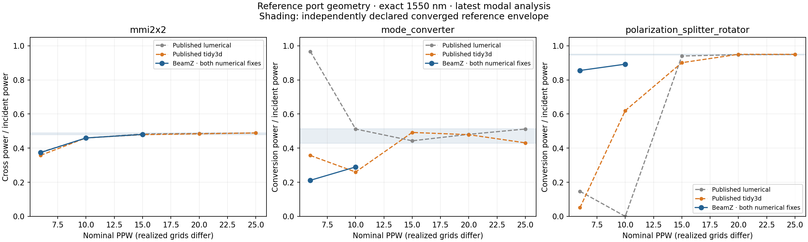
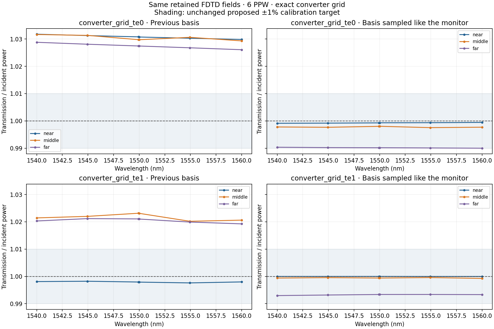
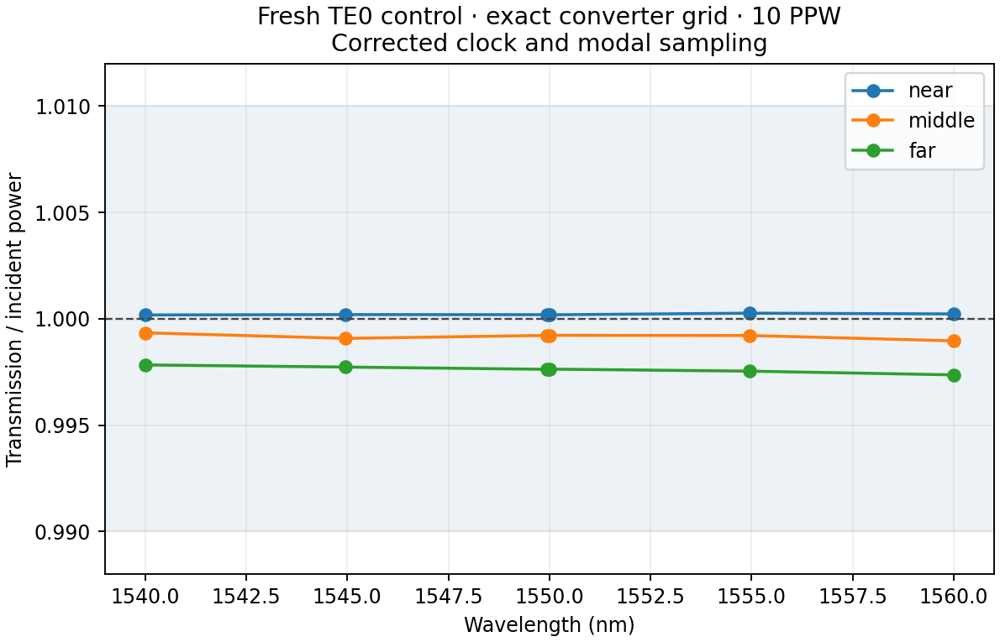
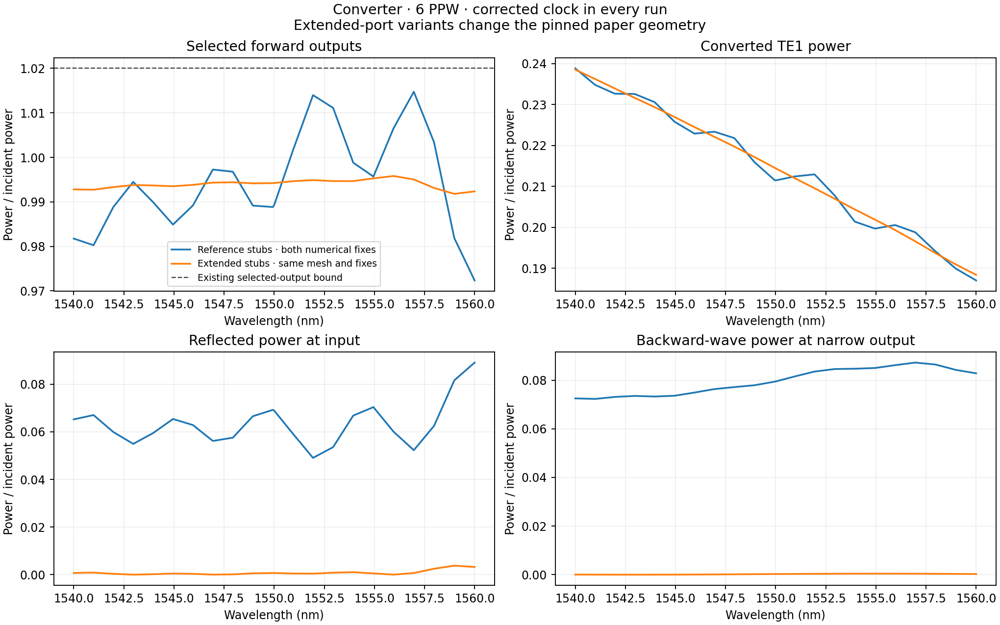
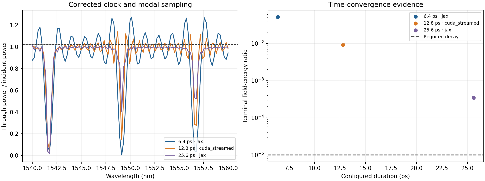
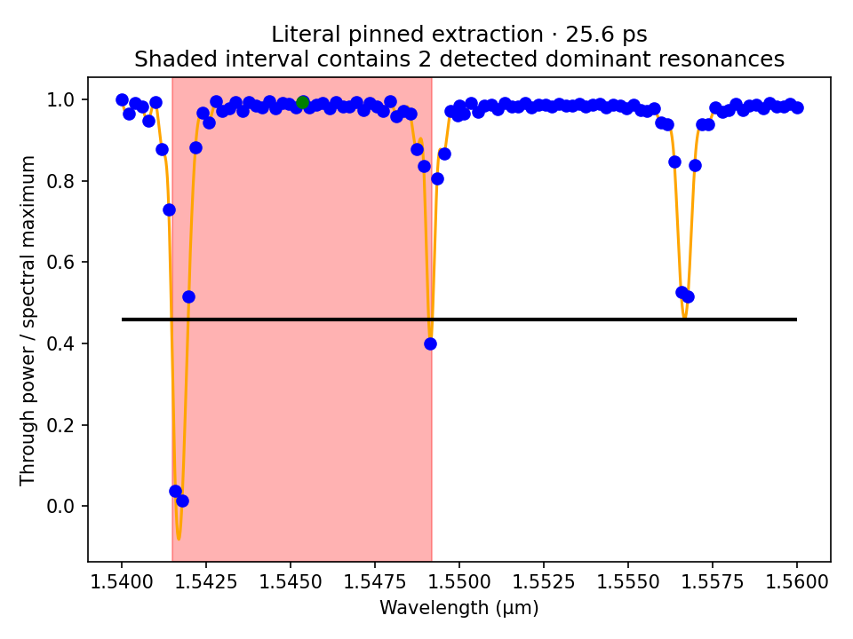

# PR #245: fixes, measurements, and remaining reproduction work

Two confirmed numerical defects are fixed: accumulating float32 monitor time and
an inconsistency between monitor sampling and the modal basis. Converter's
expected failure is removed. MMI, converter, and PSR pass the hardware validity
tests, including an explicit `1e-5` field-decay gate. **Complete reproduction of
the paper is not established.** The ring retains its narrowly scoped expected
failure at the pinned 6.40-ps runtime.

Worktree: `/home/quentinwach/Code-pr245`, branch `pr245-investigation`.
The [initial audit](../pr245-investigation/README.md) preserves the original PR
measurements and proposed acceptance criteria. Results below use both fixes
unless explicitly marked historical. Commits and field hashes are recorded per
run; the campaign spans multiple revisions, not one final checkout.

## Latest device results



Powers are evaluated at an explicitly sampled 1550 nm. Reference intervals are
published high-resolution envelopes plus the existing digitization allowance;
they are not statistical confidence intervals. Same nominal PPW does not imply
identical realized grids. The published series come from the pinned manifests;
this campaign did not independently re-digitize every point.

| Device | Measured PPW → target-mode power | Converged reference envelope | What is established |
|---|---|---|---|
| MMI | 6 → 0.374274; 10 → 0.459778; 15 → **0.480323** | 0.478–0.490 | Agreement at 15 PPW; another fine mesh is needed to demonstrate BeamZ convergence. |
| Converter | 6 → 0.211471; 10 → **0.289626** | 0.429–0.514 | Power validity improved; no eligible fine-resolution comparison yet. |
| PSR | 6 → 0.855344; 10 → **0.892234** | 0.946–0.952 | Still disagrees with the same-PPW published curves; cause is not isolated. |

MMI's 10→15 PPW change is 0.02055, so its passing 15-PPW reference comparison
must not be presented as mesh convergence. Converter and PSR need refinement
and controlled protocol comparisons. The current tests keep physical validity,
same-PPW characterization, eligible reference agreement, and demonstrated
convergence separate. The previous resolution-conditioned acceptance intervals
were excessively broad; coarse points no longer count as converged agreement.

## Confirmed numerical fixes

**Clock drift — `1e3f217b`.** Sources use integer sample indices, but JAX
previously accumulated `t += dt` in float32 for monitor DFTs. A 60,000-step
regression measured 0.530862 radians of optical phase error in the old loop.
Timestamps now come from the simulation origin and absolute integer step,
including continuation chunks. At unchanged converter geometry the dense-band
selected-output maximum fell from the original PR's 1.12326 to 1.01915 after
this fix, inside the unchanged 1.02 bound. Corrected JAX and the earlier native
backend agree to 1.55e-5 in selected-channel spectral power.

**Normal modal sampling — `d0fef56e`.** The monitor interpolates along the normal
Yee-grid direction; the old modal basis represented exact plane values. The new
basis applies the same interpolation, using the discrete propagation constant
and separate traveling-wave directions. Physical power normalization happens
before sampling and is not repeated afterward. Nine synthetic bidirectional
wave cases exercise the actual monitor sampler on x/y/z planes and recover
known amplitudes to 1e-12. This corrects extraction rather than fitting a scalar
to a desired transmission.



| Exact converter-grid control | Previous maximum transmission error | Corrected maximum error | Unchanged 1% criterion |
|---|---:|---:|---|
| TE0, 6 PPW | 3.177% | 1.000184% | Narrowly fails at the far plane |
| TE1, 6 PPW | 2.314% | 0.7031% | Passes |
| TE0, fresh 10 PPW | — | **0.2639%** | Passes |



The fresh 10-PPW TE0 run also has reflection 0.0143%, output-plane spread
0.2864 percentage points, and field decay 1.43e-9. Its near/middle/far monitors
are alternative measurements of one guide and must never be summed as outputs.
TE1/TM0 controls on other refined device grids remain necessary. The earlier
four independently meshed straight-guide runs passed but used the old clock;
they are auxiliary evidence, not final release controls. Modal and integrated
flux used the same interpolated fields, so their agreement alone could not
exclude the sampling bias.

## Port reflections: isolated, but a different geometry

The narrow converter ports are 11.858 µm from the domain edge. Their 10-µm
extensions stop 0.858 µm before the 1-µm absorber. The pinned upstream
[port extension helper](https://github.com/JPPhotonics/fdtd-pipeline/blob/622e0a9b7429eaf2335b1000b39e283544a198c4/helper_functions/generic/gds_handling.py#L32)
and [domain construction](https://github.com/JPPhotonics/fdtd-pipeline/blob/622e0a9b7429eaf2335b1000b39e283544a198c4/helper_functions/tidy3d/initiate_fdtd.py#L98)
produce the same situation. This is not uniquely a BeamZ adaptation error.



On identical recorded grid edges, extending the guides through the boundary
reduces narrow-output incoming power from **8.724% to 0.0424%** and input
reflection from **8.910% to 0.3794%**. Selected outputs plus input reflection
fall from **1.06705 to 0.99584**. Conversion changes only from 0.21147 to
0.21442, leaving the main reference discrepancy unresolved.

The default `--port-extension-policy reference` preserves the pinned setup.
`through_boundary` is an explicitly labeled physical intervention and is
ineligible for paper-reference acceptance. `--grid-from` freezes recorded
edges to isolate geometry from remeshing. In the reference setup, incoming
waves from other ports invalidate a simple single-input energy interpretation;
passing a selected-output-only bound does not establish an open-port scattering
matrix or a complete all-mode energy balance.

## Ring duration and extraction



| Configured cap | Terminal field-energy ratio | Maximum selected output | First-dip FWHM | Provisional Q |
|---|---:|---:|---:|---:|
| 6.4 ps | 5.11e-2 | 1.27324 | 0.94094 nm | 1638.5 |
| 12.8 ps | 9.25e-3 | 1.15025 | 0.62062 nm | 2484.1 |
| 25.6 ps | 3.47e-4 | 1.00988 | 0.48048 nm | 3208.7 |

The 51.2-ps-cap follow-up is still running. No completed duration pair passes
the predeclared criteria: both endpoints below `1e-5` decay and 1.02 selected
power, less than 1% FWHM/Q change, and less than 0.02 nm resonance drift.
`updated_duration_analysis.json` records the decisions. A single longer point
meeting decay would not establish time convergence. Auto-terminated runs with
different caps but the same actual stopping time are not independent duration
comparisons.

The upstream linewidth script has a separate extraction limitation. Replaying
its exact pinned function on the shifted BeamZ spectrum at 25.6 ps pairs
crossings around **two different resonances**, returning 7.7077 nm and Q 200.5.
That is not a single-resonance linewidth. BeamZ deliberately pairs the first
complete dip while retaining the cubic/global-half-depth convention; it does
not reproduce the upstream hard-coded wavelength guards.



`ring_extraction_audit.json` retains both definitions and the upstream source
hash. Cubic overshoot and the 0.2-nm retained spectrum remain limitations.
Interpolation to 0.02 nm creates no new spectral information. Refine the actual
DFT frequency grid before claiming 1% linewidth/Q stability. Do not tune an
extraction window or a fitted Q to pass the published range.

## Validation and remaining work

Validation completed during this campaign: 51 engine/runtime/clock checks,
29 native CUDA parity checks (2 Hopper-only cases excluded), 41 modal/placement/
result-contract checks, and 3 final device hardware cases. After adding explicit
MMI/converter/PSR decay gates, 28 focused protocol tests passed. Earlier focused
checks also covered automatic termination. These are targeted results, not a
claim that the entire repository suite or all paper cases pass.
`hardware_validation.json` preserves the final hardware metrics; its reported
base revision plus `hardware_validation_source.patch` identify the tested
uncommitted change, subsequently committed as `a049399a`.

The remaining order is:

1. Finish ring duration convergence with actual later endpoints, a denser DFT
   spectrum, and spatial ring/bus/boundary energy histories. Preserve the pinned
   short-duration case as characterization. Follow with empty-bus and padded
   domain/absorber sweeps on the same interior mesh. The new clearance guard
   correctly rejects 2/3-µm absorbers that would engulf existing source/ports.
2. Complete refined device-grid TE/TM controls, mode-overlap tracking, monitor
   offset/aperture and source-profile checks before accepting percent-level
   device differences. The 6-PPW TE0 control still narrowly fails.
3. Complete MMI 20/25, converter 15/20, and PSR/ring 20/25 PPW after capacity
   sizing. Keep reference geometry separate from physically corrected variants.
   Require stable finest-mesh changes as well as reference-envelope agreement.
4. If discrepancies persist, isolate matched dispersion and averaging schemes
   on unchanged grids; validate any contour-path work under issue #243 using
   independent interface/bend controls. The #244 ownership fix was already in
   the reviewed PR. It is not an explanation for these remaining differences.
   Repeat source-bandwidth studies on fixed grids and common evaluation points.
5. Re-run the final accepted protocol from clean processes with full provenance.
   Remove ring xfail only when its underlying invariant passes; do not widen
   tolerances or hide unresolved reference/convergence failures.

`resource_estimates.json` constructs the actual requested meshes without FDTD
allocation, then extrapolates measured MMI process RSS versus cell count:

| Next case | Estimated process host RSS |
|---|---:|
| MMI 20 PPW | 27.9 GiB |
| Converter 15 PPW | 35.5 GiB |
| PSR 20 PPW | 83.4 GiB |
| Ring 20 PPW | 91.7 GiB |

These are planning estimates, not measured requirements or uncertainty bounds.
The host has 30 GiB and must also accommodate the OS and other processes. The
remaining fine runs need memory reduction or a larger host, followed by actual
GPU sizing. JAX allocator statistics exclude native CUDA allocations. Timings
from this campaign are not performance comparisons because some runs shared
the GPU.

## Reproduction and evidence

`runs.json` retains the original per-run analyses, including historical results.
`reprojections.json` is the latest modal analysis of retained older field runs.
The fresh 10-PPW control already uses both fixes and lives in `runs.json`.
Reprojection checks recover previous powers within 1e-8 (observed roundoff or
zero) before applying the new basis, preserving the original FDTD data.
Compact NPZs contain complex S parameters, forward/backward waves, effective
indices, discrete wave numbers where available, residuals, conditioning, flux
checks and grids. Full raw DFT arrays remain at the local paths recorded with
SHA-256 hashes; they are not all committed. `environment.json` records versions,
GPU/driver, native ABI and binary hash. The native binary was reused from a
local worktree with identical CUDA source and passed the parity checks.

Run a fresh experiment from the worktree root, using a new output directory:

```sh
XLA_PYTHON_CLIENT_PREALLOCATE=false uv run --no-sync python \
  -m scripts.investigate_passive_soi converter_grid_te0 --ppw 10 \
  --backend cuda_streamed --exact-center --progress \
  --output validation-artifacts/pr245/control-new
```

Reanalyze pre-sampling-fix fields without rerunning FDTD:

```sh
OPENBLAS_NUM_THREADS=1 OMP_NUM_THREADS=1 JAX_PLATFORMS=cpu uv run --no-sync python \
  -m scripts.reproject_passive_soi validation-artifacts/pr245/converter-grid-te1-fixed \
  --verify-previous-unsampled-basis \
  --output validation-artifacts/pr245/reprojection-new
```

Regenerate the latest figures with `plot_reprojections.py` and
`plot_converter_ports.py --latest` in this directory. The extraction audit takes
the pinned checkout's `projects/FDTD_solvers/ring/find_FWHM.py` as its argument;
it verifies the reviewed hash and runs only that function, not solver loaders.
Historical figures remain available and should not be mixed with current-basis
results. The original physics/reference source is
[Liu and Poon, arXiv:2506.16665v3](https://arxiv.org/html/2506.16665v3).

AI-assisted implementation, experiments, plots, and analysis: OpenAI Codex.
