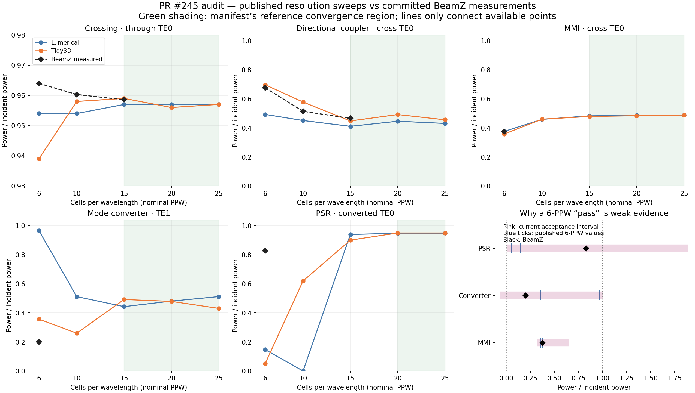
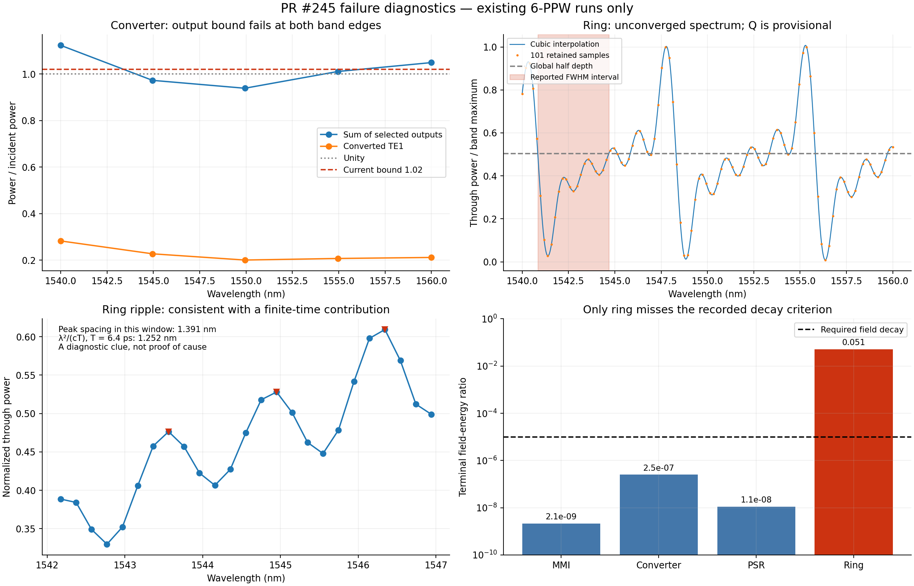

# PR #245 investigation and reproduction plan

Audit date: 2026-09-16. Reviewed head: `a54005b539b957906d0b2173e826a4069dbcf992`.
Worktree: `/home/quentinwach/Code-pr245`, branch `pr245-investigation`.
This is an analysis of committed measurements, not a new simulation campaign.

The PR adds useful fixtures and evidence, but does not yet reproduce the paper's converged results. All ten GitHub checks were successful when inspected. Of the four new hardware cases, the converter and ring are strict expected failures. The MMI and PSR pass a permissive resolution-conditioned comparison; that is weaker than demonstrating agreement with either reference solver or mesh convergence.





## What the data establish

| Device | BeamZ at approximately 1550 nm, 6 PPW | Published Lumerical / Tidy3D at 6 PPW | Interpretation |
|---|---:|---:|---|
| MMI cross TE0 | 0.37455 | 0.376 / 0.358 | Good coarse-grid agreement, but below the manifest's converged nominal 0.485; higher-resolution BeamZ runs are missing. |
| Converter TE1 | 0.20030 | 0.967 / 0.357 | Below both references; selected output sum reaches 1.12326 at 1540 nm and 1.04919 at 1560 nm. |
| PSR TE0 | 0.82782 | 0.147 / 0.051 | Large same-PPW discrepancy despite a green test; also below the manifest's converged nominal 0.94925. |
| Ring FWHM | 3.82382 nm | 0.84 / 0.88–0.90 nm | More than four times the reference width, but the spectrum is unconverged. |
| Ring Q | 403.46 | 1839.4 / 1756.5 | Provisional extraction from the same distorted spectrum, not an independent failure mechanism. |

Source: neighboring `rtx4060ti-2026-09-15/{measurements.json,spectra.json,summary.csv,ring_summary.csv}` and the pinned case manifests. The plotted older-device sweep uses `rtx3090-2026-09-16/summary.csv`; it is a different device campaign, not a cross-GPU parity experiment. Crossing and coupler already move toward their reference region as PPW increases.

### The acceptance rule hides disagreement

`converged_power_reference` in `tests/differential/passive_soi/four_port.py` computes a mean from high-resolution published samples, then uses the largest distance between that mean and either *coarse-resolution* published value as a symmetric tolerance. Consequently:

- Converter accepts −0.021 to 0.967, including zero conversion.
- PSR accepts 0.051 to 1.8475, much wider than the two 6-PPW results.
- MMI accepts 0.358 to 0.612.

These intervals are neither measured solver envelopes nor statistical confidence intervals. Merely clipping them to [0, 1] would not solve the problem. Separate physical validity, same-PPW characterization, and convergence-to-reference tests. Different realized meshes mean a same-PPW mismatch alone is not proof of a solver bug.

### Converter: a measurement or numerical consistency problem precedes fitting the paper

The run reaches field decay 2.50e-7, so its recorded failure is not the ring's timeout problem. Correctly power-normalized, distinct outgoing modes of a passive device cannot sum to more than incident power. Missing radiation or omitted modes cannot explain the excess. Possible causes include incident-wave extraction, modal power normalization/orthogonality, source profile interpolation, near-field contamination, reflected waves, or discretization errors; the committed selected-power arrays cannot distinguish these.

The adapter normalizes every outgoing amplitude by the source port's *measured forward modal amplitude in the device run*. Conversion and crosstalk share a physical monitor and are jointly projected by the analysis code. Sharing that monitor is not, by itself, evidence of double counting. Examine the actual mode basis and flux diagnostics before changing it. The source uses three frequency profiles and the retained non-ring spectrum has only five frequencies.

### Ring: failed time convergence makes the current Q inconclusive

After 6.40 ps, the field-energy ratio is 0.050719: about 5,072 times the required 1e-5. The normalized spectrum has strong baseline oscillations. The global half-depth extraction spans 1540.861–1544.685 nm, extending well beyond the first visible narrow minimum. The ring's 7.489 nm FSR is encouraging, but does not validate loss, coupling, linewidth, or Q.

The local ripple peaks between 1542 and 1547 nm have median separation 1.391 nm; the simple rectangular-window scale λ²/(cT) is 1.252 nm at 1550 nm and 6.4 ps. This is a reason to prioritize a duration sweep, not proof that truncation is the only cause. Reflection and normalization effects remain plausible. The recorded JAX/CUDA agreement on terminal decay reduces suspicion of a backend-specific failure; it does not independently validate shared numerical methods.

The [paper's FWHM script](https://raw.githubusercontent.com/JPPhotonics/fdtd-pipeline/622e0a9b7429eaf2335b1000b39e283544a198c4/projects/FDTD_solvers/ring/find_FWHM.py) uses cubic interpolation and global half depth. BeamZ uses that basic definition but does not reproduce its hard-coded wavelength guards and crossing-index convention exactly. Preserve both implementations in an extraction audit; do not blindly apply the reference's window guards to a shifted resonance or substitute a fitted Q to make this case pass.

### Mesh and protocol differences are still uncontrolled

The new adapters reject PPW values above 6. The [paper](https://arxiv.org/html/2506.16665v3) studies mesh refinement and identifies approximately 15 PPW for MMI/converter comparisons and 20 PPW for PSR/ring convergence. Equal PPW is not equal mesh: interface alignment, gap cells, vertical core cells, and subpixel coefficients matter.

BeamZ freezes material indices, uses diagonal Farjadpour averaging, and changes monitor placement/apertures relative to the reference. The contour-path difference is tracked by [issue #243](https://github.com/beamzorg/beamz/issues/243), but has not been isolated as the cause. The material-ownership correction from #244 is already included; attributing these runs to the old ownership bug would be unsupported.

## Ordered implementation and experiment plan

The numerical thresholds below are proposed engineering criteria, not quoted paper tolerances. Fix them before evaluating new runs and report sensitivity to them.

| Priority | Work and controlled experiment | Evidence required to move on |
|---|---|---|
| 0 — trustworthy harness | Keep current evidence immutable. Add overrides for duration, PPW, monitor locations, boundary thickness, source bandwidth, and raster method, with resolved configuration saved. Split validity, reference comparison, and convergence outcomes. Restrict xfail handling to known failures so unrelated errors remain visible. Add an exact 1550-nm sample; current middle sample is 1549.93548 nm. | Independent checks report every failed invariant; neither a broad band nor xfail can be described as paper reproduction. |
| 1 — normalize and identify modes | Run straight-guide controls for the 500-nm TE0 input, 1.2-µm TE0/TE1 converter output, and PSR TM0/TE0 cross-sections using identical materials, grid coordinates, apertures, and source protocol. Compare modal sums to independently integrated Poynting flux. Save incident/backward amplitudes, neff, polarization, overlaps, residuals, and conditioning at every frequency. Move monitors 0.5 and 1 µm along unchanged straight sections; enlarge apertures without crossing absorbers. | As an initial target: straight-guide T within 1% of unity, R below 1%, and power changing by less than 1 percentage point with monitor movement. Converter must satisfy its existing 1.02 selected-output bound across a denser spectrum. Any larger projection residual must be explained by omitted physical fields, not hidden. |
| 2 — establish ring time and boundary convergence | At fixed 6-PPW grid/source, run 6.4, 12.8, 25.6 ps caps; extend further only if needed. Save cumulative complex DFTs, incident power, reflection, and spatially resolved ring/bus/boundary energy versus time. Then sweep absorber thickness 1/2/3 µm and distance from the device while preserving the interior mesh. Include an empty-bus control. | Field decay below 1e-5 plus late-window spectral stability: initially target <1% relative change in FWHM/Q and <0.02 nm resonance drift under duration doubling. Determine whether ripple spacing/amplitude follows duration or boundary placement. If energy plateaus or grows, diagnose that instead of extending indefinitely. |
| 3 — reproduce reference convergence | Enable 6/10/15/20/25 PPW for all new cases. Start MMI at 10/15 as the least problematic control, converter at 10/15 after normalization, then PSR and ring through 20/25. Save actual grid coordinates, material cross-sections and gap/core cell counts. Track mode identity by field overlap, not raw index. | Plot all BeamZ points against both published solver series. Require stable changes between the finest two meshes and agreement with independently fixed reference envelopes plus digitization uncertainty. For fluctuating converter/coupler series, report residual error instead of manufacturing a narrow consensus tolerance. |
| 4 — isolate remaining solver differences | On a fixed grid, compare constant-index and matched dispersive material models; compare supported averaging methods on analytic interface/bend controls before full devices. Implement contour-path support under #243 only with independent validation. Repeat 20/50-nm source-bandwidth tests on a frozen grid, with matching evaluation wavelengths. | Quantified change from each individual intervention, including modal neff, phase, power, resonance wavelength, and Q. Broadband/source-profile consistency must hold before claiming agreement with a spectral feature. |
| 5 — release evidence | Re-run the final protocol from clean processes; preserve raw complex monitor data, grids, geometry hashes, exact code revision, software versions, decay history, time/memory, and plots. Remove expected failures only when their underlying invariants pass. | Hardware validity and reference/convergence results both pass, with remaining limitations explicit. |

Do not start with a full 25-PPW sweep: it would spend resources on an unvalidated measurement chain. Use the available 24-GiB RTX 3090 for pilot sizing, recording peak GPU/host memory at each resolution before scheduling larger cases. Adaptive-grid scaling must be measured rather than inferred from a uniform-grid cube law.

## Evidence limitations and reproducibility

The committed files contain selected powers and summary metadata, not the original complex `monitor_data.npz` files. SHA-256 strings document identity but cannot reconstruct those arrays or support a new modal projection. Recover the retained files or regenerate them during steps 1–2. There are no committed energy time histories to fit a decay constant. No new FDTD runs were performed for this audit.

The non-ring curves contain five samples, despite an artifact note claiming 101-point selected spectra. Only the ring has 101 retained samples. Published curves in `resolution_audit.png` use the manifest's existing digitizations; they have not been independently re-digitized. Audit those values against source figures before tightening tolerances. Also correct the ring manifest's mistaken author attribution (“Zhu et al.”; the paper is Liu and Poon).

Recreate the two audit plots and derived metrics from the repository root:

```sh
python tests/differential/results/pr245-investigation/plot_diagnostics.py
```

Dependencies: NumPy, SciPy, Matplotlib. No solver imports, GPU, network, or new simulation data are required. `derived_metrics.json` records the ripple diagnostic and independently recomputed 3.8238238-nm FWHM.
