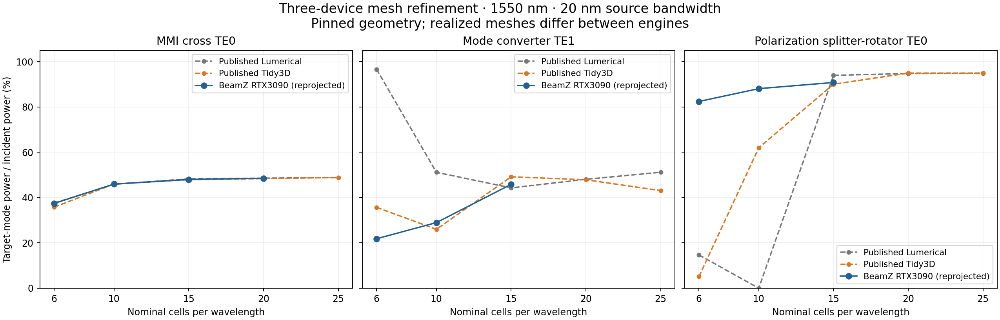

# PR245 passive-SOI comparison

The MMI, mode converter, and polarization splitter-rotator use the pinned
geometries from [Liu and Poon](https://arxiv.org/abs/2506.16665).
The retained runs used a local RTX3090, float32 fields, and `cuda_streamed`.
Their fields were reprojected after withdrawing the extra modal
normal-interpolation correction. The table compares target-mode power at
exactly 1550 nm with a 20 nm source bandwidth. Published values come from the
case manifests;
some are approximate figure digitizations. Equal PPW does not imply an
identical realized mesh.

| Device / target mode | PPW | Published Lumerical | Published Tidy3D | BeamZ |
|---|---:|---:|---:|---:|
| MMI cross TE0 | 6 | 37.6% | 35.8% | 37.45% |
| MMI cross TE0 | 10 | 45.9% | 46.0% | 45.99% |
| MMI cross TE0 | 15 | 48.3% | 47.9% | 48.04% |
| MMI cross TE0 | 20 | 48.6% | 48.4% | 48.53% |
| Converter TE1 | 6 | 96.7% | 35.7% | 21.84% |
| Converter TE1 | 10 | 51.2% | 26.0% | 28.97% |
| Converter TE1 | 15 | 44.3% | 49.2% | 45.86% |
| PSR TE0 | 6 | 14.7% | 5.1% | 82.47% |
| PSR TE0 | 10 | 0.0% | 62.0% | 88.13% |
| PSR TE0 | 15 | 94.0% | 90.1% | 90.85% |

All ten original field runs pass the `1e-5` decay gate. Their revised spectra
pass the unchanged `1.02` selected-output bound at all six retained frequencies.
These checks cover selected modes,
not a complete guided/radiated energy balance.

- MMI at 20 PPW agrees with the published 48.4–48.6% range. The change from
  15 PPW is 0.497 percentage points.
- Converter at 15 PPW lies inside the published 44.3–49.2% range, but its
  10→15 PPW change is 16.889 percentage points. Further refinement is needed.
- PSR at 15 PPW lies inside the published 90.1–94.0% range. It has not reached
  the 20-PPW resolution required for its converged-reference comparison.

These observations do not demonstrate complete paper reproduction or mesh
convergence. BeamZ uses fixed material indices evaluated at 1550 nm, while the
commercial references use fitted dispersive models.



[convergence.json](convergence.json) contains every BeamZ and published sample
plotted above. The figure includes the latest 20-PPW MMI and 15-PPW converter
and PSR runs. Regenerate both files from the retained results and manifests with
`python tests/differential/results/pr245/plot_convergence.py`.

## Evidence

[results.json](results.json) retains the ten configurations, executing commits,
raw-field and source-record hashes, decay/power checks, reference comparisons,
runtime and memory measurements, plus the separate reanalysis revision. Each
record links one compact NPZ in
[spectra/](spectra/) containing complex S parameters, incident power, modal
and flux diagnostics, and realized grid edges. The nonempty PSR source patch
is retained in [source-patches/](source-patches/). Per-run executing revisions
and patches describe the observations. The old corrected projection reproduces
the recorded powers exactly on all ten field datasets, verifying the inputs to
this comparison. Reprojection preserves the grids, measured fluxes and source
records. FDTD provenance predates later main/CPML updates; evaluating those
changes requires new field runs. Larger raw fields remain at the local paths
recorded in the JSON.
[environment.json](environment.json) records packages, native binary hashes,
and hardware.

The matched 15-PPW MMI material-preparation control retains an identical
complete raw-monitor hash before and after reuse. Peak JAX allocation decreased
from 6.32 to 4.79 GiB; host peak RSS did not improve. These are descriptive
single samples, and JAX statistics omit native CUDA allocations. The paired
record is included in `results.json`.

Withdrawal validation: **63 focused CPU checks** and **7 RTX3090 JAX/CUDA parity
checks** pass. Both full notebooks complete on both GPU backends. Their raw
fields and fluxes are bitwise unchanged from the correction-enabled runs.
The modal broadband fundamental returns to 0.99999917 W at 1.55 µm; all 37 CUDA
exports match the earlier disabled-correction control bitwise. Cosine crossing
remains at −0.12151 dB transmission and −29.15515 dB crosstalk at 1.31 µm.

All raw and forward-power comparisons pass. Strict per-array comparisons flag
one JAX/CUDA reflection curve (maximum absolute difference `8.72e-9 W`) and
three backward/unresolved curves against the October 1 baseline (at most
`3.74e-8 W`). These flags remain recorded in `results.json`; tolerances were
unchanged. All ten retained spectra have verified hashes, finite arrays,
valid incident signals, and center powers matching their complex S parameters.
Source-patch hashes, report links, Ruff, and whitespace checks also pass.
These are focused checks with retained-field reanalysis.

## Reproduction

Install the test and GDS extras and build the optional CUDA component as
explained in [cuda/README.md](../../../../cuda/README.md). Use a fresh output
path for each run:

```sh
CUDA_VISIBLE_DEVICES=0 XLA_PYTHON_CLIENT_PREALLOCATE=false \
OPENBLAS_NUM_THREADS=1 OMP_NUM_THREADS=1 python \
  -m scripts.investigate_passive_soi mmi2x2 --ppw 20 \
  --backend cuda_streamed --exact-center \
  --output validation-artifacts/pr245-repeat/mmi-20
```

Substitute `mode_converter --ppw 15` or
`polarization_splitter_rotator --ppw 15` for the other refined cases.
Omit `--exact-center` when reproducing the default hardware test's original
five-frequency sampling. Use `--backend jax` for the JAX execution path.
No geometry variant or acceptance threshold is changed by these commands.

Reproject a retained field directory with the current production basis:

```sh
JAX_PLATFORMS=cpu OPENBLAS_NUM_THREADS=1 OMP_NUM_THREADS=1 python \
  -m scripts.reproject_passive_soi <retained-field-directory> \
  --output validation-artifacts/pr245-repeat/reprojected
```

Execute either full notebook with the existing validation runner:

```sh
OPENBLAS_NUM_THREADS=1 OMP_NUM_THREADS=1 python scripts/validate_modal_notebook.py \
  --root . --output validation-artifacts/pr245-repeat/modal-jax \
  --notebook modal_sources_monitors --backend jax --expected-device "RTX 3090"
```

Use `--notebook cosine_waveguide_crossing` or `--backend cuda_streamed` for
the other notebook/backend combination. Executed copies contain backend
selection and numerical exports; the original notebooks retain their full settings.

AI assistance: OpenAI Codex implemented the benchmark follow-up, ran the
recorded experiments, and consolidated this report.
