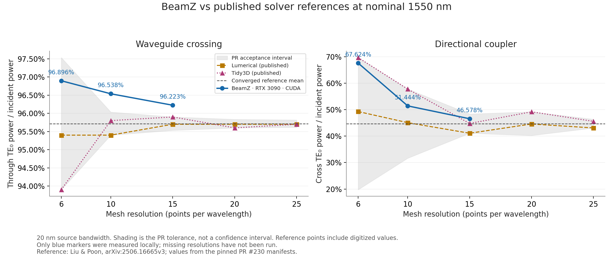
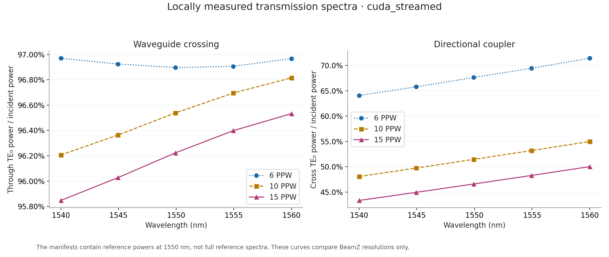
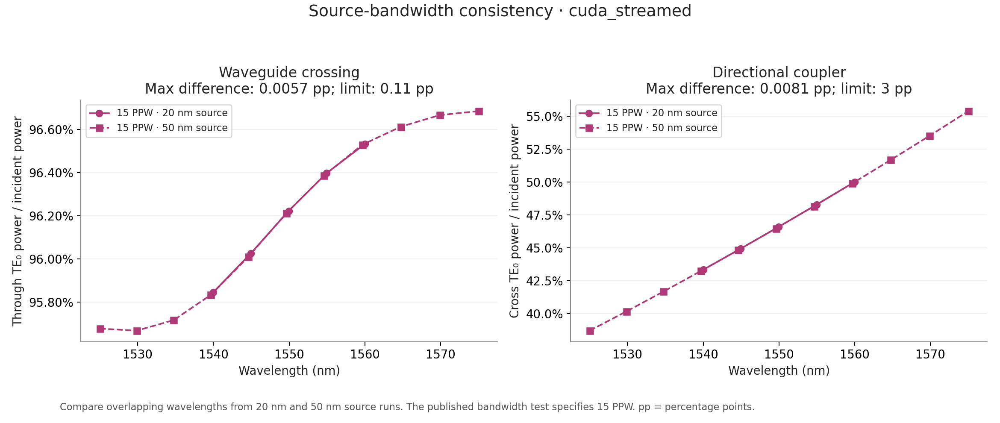

# RTX 3090 passive-SOI benchmark evidence

These three figures summarize eight local `cuda_streamed` simulations: both
devices at 6/10/15 PPW with a 20-nm source, plus both devices at 15 PPW with a
50-nm source. The PR's geometry, solver settings and tolerances were unchanged.

[measurements.json](measurements.json) contains the plotted spectra, reference
comparisons, bandwidth checks, runtime data and environment provenance. The
measurements used PR head `a151fff` plus the PDK scope fix on main `5e5ffdee`;
production solver/CUDA sources match the PR head, with release-version metadata
differing. Full local monitor arrays and diagnostic plots are not committed.

## Reference power



The crossing passes at 6 PPW and fails at 10 and 15 PPW. Its 15-PPW through power
is 0.962228 versus the acceptance interval 0.955333–0.959000. The directional
coupler passes at all three tested resolutions. All applicable secondary loss
and output-power checks pass. The 20/25-PPW cases remain untested locally.

The grey envelope is the PR acceptance interval, not statistical confidence.
Published values are from the pinned case manifests; no proprietary solver was
run locally. The 1550-nm comparison uses the adapter's closest frequency sample
(approximately 1549.935 nm for the 20-nm source).

## Transmission spectra



The manifests provide reference powers at 1550 nm, not complete reference
spectra. These curves compare BeamZ resolutions only.

## Source bandwidth



At 15 PPW, maximum differences on overlapping wavelengths are 0.000057175 for
the crossing (limit 0.0011) and 0.000081275 for the coupler (limit 0.03), in
absolute power fractions. Both pass. The small bandwidth effect does not explain
the crossing's remaining offset from the converged nominal.

All eight runs report `converged`; saved monitor arrays are finite and all
incident-power validity masks pass. Peak whole-device GPU use was 19.15 GiB,
including desktop use. These are shared-desktop timings, not isolated hardware
performance comparisons.

## Reproduce simulations

With GPU-enabled JAX and BeamZ's native CUDA component installed, run each
resolution in a fresh process from the repository root, for example:

```sh
XLA_PYTHON_CLIENT_PREALLOCATE=false \
XLA_PYTHON_CLIENT_MEM_FRACTION=0.80 \
BEAMZ_EXECUTION_BACKEND=cuda_streamed \
BEAMZ_VALIDATION_ARTIFACT_DIR=validation-artifacts \
python -m pytest tests/differential/test_crossing.py \
  -m hardware -k 6ppw --validation-report=validation-results-crossing-6ppw.json
```

Select `10ppw` or `15ppw`, or use `test_directional_coupler.py`, for the other
resolution cases. Select `spectrum_is_consistent` for the 15-PPW bandwidth tests.
The crossing's existing 10-PPW strict-xfail marker remains; its 15-PPW test is an
ordinary failing assertion with the measurements above. Direct adapter calls
were used for these measurements so every comparison was retained independently
of pytest's expected-failure handling.
